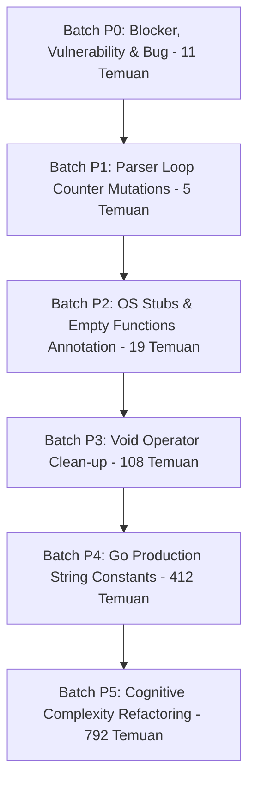

# Rencana Perbaikan SAST: Khusus Kode Produksi (Production Fixing Plan)

> **Catatan:** Dokumen resmi tersimpan di [`support_docs/SAST/sast_fixing_plan_production.md`](file:///d:/Kerjaan/Project/taskor2/support_docs/SAST/sast_fixing_plan_production.md).

**Dokumen Sumber:** `support_docs/SAST/SAST.xlsx` (Sheet `Blocker` & `Critical`)  
**Ruang Lingkup:** Seluruh file kode produksi (Production Code) di `server/`, `packages/`, `apps/`, dan `examples/`  
**Total Temuan Produksi:** **1.347 Temuan** (1 Blocker + 1.346 Critical)  
**Status Dokumen:** Perencanaan & Analisis Mendalam (Belum Dieksekusi / Menunggu Persetujuan)

---

## 1. Ringkasan Eksekutif Temuan Kode Produksi

Dari total 5.001 temuan SAST pada proyek Taskor2, sebanyak **1.347 temuan (26,9%)** berada pada kode produksi yang berjalan di aplikasi aktif. Memprioritaskan perbaikan pada kode produksi merupakan langkah tepat untuk:
1. Menghilangkan kerentanan keamanan riil (*real-world security risks*).
2. Memperbaiki bug semantik & logika tipe runtime.
3. Menjaga efisiensi token AI dan stabilitas aplikasi sebelum menyentuh suite pengetesan.

### A. Distribusi Rule pada Kode Produksi (1.347 Temuan)
| No | Rule Key | Tipe Temuan | Deskripsi Masalah | Jumlah Temuan | Jumlah File |
|:---:|---|:---:|---|:---:|:---:|
| 1 | `typescript:S3516` | **BLOCKER** (Code Smell) | Fungsi selalu me-*return* nilai yang sama (`true`) | **1** | 1 |
| 2 | `javascript:S2819` | **VULNERABILITY** | Kurangnya validasi origin / targetOrigin pada `postMessage` | **6** | 3 |
| 3 | `typescript:S2819` | **VULNERABILITY** | Target origin tidak spesifik pada `postMessage` | **2** | 2 |
| 4 | `typescript:S4335` | **BUG** | Tipe perpotongan kosong / tanpa member (`string & {}`) | **2** | 2 |
| 5 | `typescript:S2310` | CODE SMELL | Assignment/modifikasi loop counter `i` di dalam for-loop | **4** | 2 |
| 6 | `javascript:S2310` | CODE SMELL | Assignment loop counter `i` di dalam for-loop | **1** | 1 |
| 7 | `go:S1186` | CODE SMELL | Fungsi Go kosong tanpa komentar (OS stubs / no-op) | **19** | 14 |
| 8 | `typescript:S3735` | CODE SMELL | Penggunaan operator `void` yang redundan pada promise | **108** | 57 |
| 9 | `go:S1192` | CODE SMELL | Duplikasi string literal (≥ 3 kali per file) di Go | **412** | 122 |
| 10 | `go:S3776` | CODE SMELL | Cognitive Complexity pada method Go (> 15) | **508** | 227 |
| 11 | `typescript:S3776` | CODE SMELL | Cognitive Complexity pada function TypeScript (> 15) | **283** | 191 |
| 12 | `javascript:S3776` | CODE SMELL | Cognitive Complexity pada plugin JavaScript (> 15) | **1** | 1 |
| | **TOTAL** | | | **1.347** | **623** |

---

## 2. Batch Fixing Strategy: Khusus Produksi (6 Gelombang)

Penyelesaian 1.347 temuan produksi dibagi menjadi **6 Batch Bertahap (Batch P0 hingga Batch P5)** yang terurut dari risiko keamanan tertinggi hingga refaktorisasi arsitektur:



---

### 🟢 BATCH P0: Blocker, Security Vulnerabilities, & Bugs (Total: 11 Temuan) — [STATUS: SELESAI / COMPLETED]
*Prioritas: Tertinggi (Immediate). Menuntaskan seluruh Blocker produksi, Vulnerability security, dan runtime Type Bugs.*
*Status: Berhasil diimplementasikan pada 8 file dan lolos verifikasi typecheck (@multica/core, @multica/plugin-sdk, @multica/views).*

#### Sub-batch P0.1: Blocker Return Value (`typescript:S3516`) — 1 Temuan
- **Lokasi:** [`packages/views/editor/extensions/file-upload.ts:96`](file:///d:/Kerjaan/Project/taskor2/packages/views/editor/extensions/file-upload.ts#L96)
- **Akar Masalah:**
  ```ts
  export function insertUploadPlaceholder(editor: any, upload: { uploadId: string; ... }): boolean {
    if (findUploadNode(editor, upload.uploadId)) return true; // Branch 1
    ...
    editor.chain().insertContentAt(...).run();
    return true; // Branch 2
  }
  ```
  Fungsi memiliki tipe kembalian `boolean`, tetapi kedua cabang selalu mengembalikan `true`.
- **Rencana Perbaikan:**
  - Kembalikan `false` jika node upload sudah ada (`if (findUploadNode(editor, upload.uploadId)) return false;`), yang secara semantik menandakan tidak ada placeholder baru yang disisipkan.
  - Kembalikan `false` jika instance editor tidak valid / belum ter-mount (`if (!editor?.view) return false;`).
  - Kembalikan `true` jika node berhasil dibuat dan di-dispatch ke dokumen.

#### Sub-batch P0.2: Cross-Origin Message Security (`javascript:S2819` & `typescript:S2819`) — 8 Temuan
- **Lokasi File:**
  1. [`packages/plugin-sdk/index.ts:131`](file:///d:/Kerjaan/Project/taskor2/packages/plugin-sdk/index.ts#L131)
  2. [`packages/views/plugins/surface-bridge.ts:144`](file:///d:/Kerjaan/Project/taskor2/packages/views/plugins/surface-bridge.ts#L144)
  3. [`examples/plugins/hello-panel/ui/main.js:16, 48`](file:///d:/Kerjaan/Project/taskor2/examples/plugins/hello-panel/ui/main.js#L16)
  4. [`examples/plugins/release-checklist/ui/main.js:16, 48`](file:///d:/Kerjaan/Project/taskor2/examples/plugins/release-checklist/ui/main.js#L16)
  5. [`examples/plugins/triage-notify/ui/main.js:17, 43`](file:///d:/Kerjaan/Project/taskor2/examples/plugins/triage-notify/ui/main.js#L17)
- **Akar Masalah:** 
  - Penggunaan `window.parent.postMessage(..., "*")` tanpa pembatasan origin penerima.
  - Listener `window.addEventListener("message", ...)` tidak melakukan pemeriksaan eksplisit `event.origin` terhadap origin host yang dipercaya.
- **Rencana Perbaikan:**
  - Pada `surface-bridge.ts`: Gunakan origin target yang spesifik dari konfigurasi plugin atau validasi origin sandboxed iframe (`event.origin === "null"` atau origin window parent).
  - Pada `examples/plugins/*`: Tambahkan pengecekan keamanan origin sebelum memproses pesan data:
    ```js
    if (event.origin !== window.location.origin && event.source !== window.parent) return;
    ```

#### Sub-batch P0.3: Loose Autocomplete Type Bugs (`typescript:S4335`) — 2 Temuan
- **Lokasi File:**
  1. [`packages/core/types/agent.ts:312`](file:///d:/Kerjaan/Project/taskor2/packages/core/types/agent.ts#L312):
     ```ts
     failure_reason?: TaskFailureReason | (string & {}) | "";
     ```
  2. [`packages/core/types/issue.ts:31`](file:///d:/Kerjaan/Project/taskor2/packages/core/types/issue.ts#L31):
     ```ts
     export type IssueStatus = IssueStatusCategory | (string & {});
     ```
- **Akar Masalah:** Pola `(string & {})` digunakan untuk trik TypeScript agar autocompletion union tidak collapse menjadi `string` polos. Namun Sonar mengidentifikasinya sebagai BUG karena `{}` tidak memiliki properti apapun.
- **Rencana Perbaikan:**
  Gunakan tipe idiomatic TypeScript modern yang kompatibel dan tidak memicu rule S4335:
  ```ts
  export type LooseAutocomplete<T extends string> = T | (string & Record<never, never>);
  ```
  Terapkan pada `failure_reason` dan `IssueStatus`.

---

### 🟢 BATCH P1: Parser Loop Counter Mutations (Total: 5 Temuan) — [STATUS: SELESAI / COMPLETED]
*Karakteristik: Menghilangkan potensi infinite loop atau manipulasi variabel pencacah dalam for-loop.*
*Status: Berhasil diimplementasikan pada linkify.ts, runtime-profile-catalog.ts, dan package.mjs; lolos verifikasi typecheck (@multica/ui, @multica/views).*

- **Rule Key:** `typescript:S2310` (4 temuan) & `javascript:S2310` (1 temuan)
- **Lokasi File:**
  1. [`packages/ui/markdown/linkify.ts:197, 206`](file:///d:/Kerjaan/Project/taskor2/packages/ui/markdown/linkify.ts#L197) (2 temuan)
  2. [`packages/views/runtimes/components/runtime-profile-catalog.ts:122, 146`](file:///d:/Kerjaan/Project/taskor2/packages/views/runtimes/components/runtime-profile-catalog.ts#L122) (2 temuan)
  3. [`apps/desktop/scripts/package.mjs:242`](file:///d:/Kerjaan/Project/taskor2/apps/desktop/scripts/package.mjs#L242) (1 temuan)
- **Akar Masalah:**
  Pada tokenizer teks dan parser argument CLI, kode menggunakan `for (let i = 0; i < len; i++)`, namun di dalam tubuh perulangan terdapat penambahan manual seperti `i += 1` atau `i = end - 1` untuk melompati karakter escape/tanda baca.
- **Rencana Perbaikan:**
  Ubah perulangan menjadi struktur `while (i < len)`:
  ```ts
  let i = 0;
  while (i < text.length) {
    ...
    if (escaped) {
      i += 2;
      continue;
    }
    i++;
  }
  ```

---

### 🟢 BATCH P2: Cross-Platform OS Stubs & Empty Functions (Total: 19 Temuan) — [STATUS: SELESAI / COMPLETED]
*Karakteristik: Perubahan dokumentatif 100% aman, risiko regresi nol.*
*Status: Berhasil diimplementasikan pada 14 file Go produksi; lolos kompilasi go build tanpa error.*

- **Rule Key:** `go:S1186` (19 temuan pada 14 file Go produksi)
- **Daftar File & Konteks:**
  1. `server/cmd/multica/cmd_daemon_unix.go (39)` — Stub OS daemon
  2. `server/internal/analytics/client.go (127, 128)` — No-op analytics methods
  3. `server/internal/cli/update_unix.go (16)` — Stub OS update
  4. `server/internal/daemon/execenv/isolation_unix.go (39)` — Stub isolation Unix
  5. `server/internal/daemon/processtree/controller_unix.go (78)` — Stub process controller
  6. `server/internal/daemon/repocache/cache.go (764)` — Stub cache event
  7. `server/internal/handler/runtime_liveness_store.go (65)` — Stub store cleanup
  8. `server/internal/integrations/telegram/resolvers.go (304)` — Stub resolver
  9. `server/internal/integrations/wecom/metrics.go (61, 62, 63, 64)` — No-op metrics counters
  10. `server/internal/util/proc_other.go (6)` — Stub non-windows process
  11. `server/pkg/agent/codex.go (2311)` — Stub cleanup agent
  12. `server/pkg/agent/proc_other.go (14, 37)` — Stub process platform
  13. `server/pkg/agent/proc_windows.go (49)` — Stub process Windows
  14. `server/pkg/llm/client.go (485)` — Stub LLM provider handler
- **Rencana Perbaikan:**
  Tambahkan komentar penjelas eksplisit di dalam kurung kurawal fungsi `{}`:
  ```go
  // no-op: intentionally empty for this OS platform / no-op provider implementation.
  ```

---

### 🟢 BATCH P3: TypeScript Void Operator Removal (Total: 108 Temuan) — [STATUS: SELESAI / COMPLETED]
*Karakteristik: Standardisasi kode pemanggilan asynchronous unawaited promise.*
*Status: Berhasil diimplementasikan pada 57 file produksi (108 temuan); lolos verifikasi typecheck seluruh workspace (@multica/core, @multica/views, @multica/desktop, @multica/web, @multica/mobile).*

- **Rule Key:** `typescript:S3735` (108 temuan pada 57 file produksi)
- **File Terbanyak:**
  - `packages/views/agents/create/use-builder-session.ts` (6 temuan)
  - `packages/views/settings/components/billing-tab.tsx` (6 temuan)
  - `apps/mobile/app/(auth)/verify.tsx` (5 temuan)
  - `apps/desktop/src/renderer/src/platform/client-usage-reporter.tsx` (4 temuan)
  - `packages/core/client-usage/reporter.tsx` (4 temuan)
  - `packages/views/billing/billing-test-page.tsx` (4 temuan)
  - `packages/views/common/task-transcript/agent-transcript-dialog.tsx` (4 temuan)
  - `packages/views/search/search-command.tsx` (4 temuan)
  - `apps/desktop/src/main/index.ts` (3 temuan)
  - `apps/desktop/src/renderer/src/platform/issue-window-navigation.tsx` (3 temuan)
  - `packages/core/billing/workspace-subscription-mutations.ts` (3 temuan)
  - `packages/core/issue-views/mutations.ts` (3 temuan)
  - `packages/views/agents/components/agent-detail-page.tsx` (3 temuan)
  - `packages/views/issues/components/table-view.tsx` (3 temuan)
  - `packages/views/issues/surface/use-issue-group-branches.ts` (3 temuan)
  - `packages/views/settings/components/use-auto-save.ts` (3 temuan)
- **Akar Masalah:**
  Penggunaan sintaks `void promiseFn();` yang dimaksudkan untuk membungkam linter floating-promise, namun SonarQube mengkategorikannya sebagai pemborosan operator `void`.
- **Rencana Perbaikan:**
  Hapus kata kunci `void` pada pemanggilan ekspresi mandiri (`promiseFn();`), atau jika fungsi berpotensi melempar unhandled rejection berikan `.catch((err) => ...)` sederhana.

---

### 🔵 BATCH P4: Go Production String Literal Constants (Total: 412 Temuan)
*Karakteristik: Konsolidasi string literal yang berulang ≥ 3 kali pada 122 file Go backend produksi.*

- **Rule Key:** `go:S1192` (412 temuan pada 122 file)
- **Pengelompokan Sub-Modul:**

#### Sub-batch P4.1: CLI Commands Flags & Help Text (`server/cmd/multica/`) — 121 Temuan — [STATUS: SELESAI / COMPLETED]
- **Status:** Berhasil diimplementasikan dengan membuat `server/cmd/multica/flags_const.go` (89 konstanta) dan memperbarui 19 file CLI (636 substitusi literal); lolos kompilasi `go build` dan seluruh unit tests `go test ./cmd/multica`.
- **File Utama:**
  - `cmd_agent.go` (16), `cmd_issue.go` (15), `cmd_daemon.go` (14), `cmd_project.go` (12), `cmd_squad.go` (8), `cmd_workspace.go` (7), `cmd_agent_copy.go` (6), `cmd_autopilot.go` (6), `cmd_issue_label.go` (6), `cmd_issue_metadata.go` (6), `cmd_property.go` (4), `cmd_skill.go` (4), `cmd_auth.go` (3), `cmd_label.go` (3), `cmd_runtime_profile.go` (3), `cmd_setup.go` (3), `cmd_config.go` (2), `cmd_runtime.go` (2), `cmd_repo.go` (1).
- **Literal Berulang:** `"Output format: table or json"`, `"full-id"`, `"thinking-level"`, `"service-tier"`, `"/api/issues/"`, `"resolve issue: %w"`, dll.
- **Solusi:** File konstanta bersama `server/cmd/multica/flags_const.go` berisi definisi flag CLI, path API, dan deskripsi/error standar.

#### Sub-batch P4.2: HTTP Handlers Error & API Paths (`server/internal/handler/`) — 164 Temuan
- **File Utama:**
  - `autopilot.go` (13), `issue.go` (12), `chat.go` (10), `skill.go` (10), `workspace_mcp_api.go` (7), `file.go` (6), `comment.go` (5), `dingtalk.go` (5), `invitation.go` (5).
- **Literal Berulang:** `"invalid request body"`, `"database not available"`, `"workspace not found"`, `"/api/issues/"`, `"resolve issue: %w"`.
- **Solusi:** Ekstrak konstanta error terpusat di `server/internal/handler/constants.go`.

#### Sub-batch P4.3: Core Daemon, Router & Agent Service (`server/internal/daemon/`, `router.go`, `pkg/agent/`) — 110 Temuan
- **File Utama:**
  - `server/cmd/server/router.go` (11): `"Content-Type"`, `"application/json"`, `"X-User-ID"`.
  - `server/internal/daemon/repocache/cache.go` (11), `server/internal/service/task.go` (8), `server/pkg/agent/codex.go` (8), `server/pkg/agent/models.go` (8).
- **Solusi:** Gunakan `http.HeaderContentType` dari standard library dan ekstrak konstanta lokal di masing-masing package.

---

### 🟣 BATCH P5: Cognitive Complexity Refactoring (Total: 792 Temuan)
*Karakteristik: Tingkat kesulitan tertinggi. Membutuhkan ekstraksi fungsi cerdas tanpa merusak alur kontrol bisnis.*

- **Rule Key:** `go:S3776` (508 temuan pada 227 file) + `typescript:S3776` (283 temuan pada 191 file) + `javascript:S3776` (1 temuan)
- **Pembagian Berdasarkan Tingkat Keparahan:**

#### Gelombang P5.1: Ekstrem Kompleksitas di Go Backend (Skor > 100) — 15 Fungsi
| Skor | Lokasi File & Baris | Fungsi Utama | Strategi Dekomposisi |
|:---:|---|---|---|
| **566** | `server/internal/handler/daemon.go (1890)` | Dispatcher Daemon Lifecycle | Pecah ke dalam sub-handler terpisah untuk *start*, *stop*, *handshake*, dan *healthcheck*. |
| **211** | `server/internal/daemon/daemon.go (6308)` | Task Execution Loop | Ekstrak tahap validasi lingkungan, penyiapan git worktree, dan logging ke fungsi terpisah. |
| **164** | `server/internal/handler/issue.go (3856)` | Bulk Issue Mutation | Ekstrak pipeline mutasi per-field (status, assignee, priority, labels). |
| **148** | `server/cmd/server/router.go (318)` | Router Route Registration | Kelompokkan pendaftaran endpoint ke dalam sub-router modular (`registerIssueRoutes`, dll). |
| **147** | `server/pkg/agent/codex.go (936)` | LLM Stream Event Parser | Ekstrak parser event JSON ke state machine parser mandiri. |
| **137** | `server/internal/handler/issue.go (1014)` | Issue Query Filters | Gunakan builder pola filter query terpisah. |
| **133** | `server/internal/handler/agent.go (1580)` | Agent Prompt Compilation | Pisahkan parsing template prompt dari resolusi dependensi skill. |
| **129** | `server/internal/handler/issue.go (3238)` | Issue Detail Aggregator | Pisahkan query komentar, reaksi, dan metadata ke helper terpisah. |
| **125** | `server/cmd/server/notification_listeners.go (633)` | Event Relay Dispatcher | Ekstrak worker switch-case event handler. |
| **122** | `server/internal/handler/issue.go (1702)` | Issue Update Transaction | Pisahkan logika side-effect notifikasi dari transaksi database. |

#### Gelombang P5.2: Ekstrem Kompleksitas di Frontend TypeScript (Skor > 100) — 7 Fungsi/Hooks
| Skor | Lokasi File & Baris | Komponen / Hook | Strategi Dekomposisi |
|:---:|---|---|---|
| **203** | `packages/core/realtime/use-realtime-sync.ts (748)` | Realtime Sync Coordinator | Pecah handler event WebSocket per domain entity (issue, agent, presence). |
| **184** | `packages/views/issues/surface/use-issue-surface-controller.ts (201)` | Issue Surface Controller | Pisahkan keyboard shortcut handling dari pagination state controller. |
| **159** | `packages/views/settings/components/billing-tab.tsx (217)` | Billing Tab View Component | Dekomposisi sub-komponen: InvoiceTable, PlanSelector, UsageMeters. |
| **118** | `packages/views/editor/use-coordinated-uploads.ts (241)` | Coordinated Uploads Manager | Pisahkan upload queue tracker dari thumbnail generation logic. |
| **117** | `packages/views/chat/components/use-chat-controller.ts (204)` | Chat Message Controller | Ekstrak streaming reader dan tool invocation parser ke custom hook. |
| **111** | `packages/core/issues/cache-coordinator.ts (321)` | Query Cache Coordinator | Gunakan map lookup strategy pengganti nested if-else. |
| **106** | `apps/desktop/src/main/index.ts (611)` | Window Lifecycle Manager | Ekstrak sub-menu & IPC handler registration ke file terpisah. |

#### Gelombang P5.3: Kompleksitas Sedang di Kode Produksi (Skor 16 - 99)
- Eksekusi bertahap per direktori:
  - `packages/core/` (58 fungsi)
  - `packages/views/` (190 fungsi)
  - `apps/desktop/` & `apps/mobile/` (35 fungsi)
  - `server/` (Sisanya pada backend Go)

---

## 3. Matriks Roadmap Eksekusi Kode Produksi

| Batch | Fokus Perbaikan | Target Temuan | Estimasi File | Estimasi Token | Verifikasi Wajib |
|:---:|---|:---:|:---:|:---:|---|
| **Batch P0** | Blocker (1), Vulnerability (8), Bug (2) | **11** | 8 | Sangat Rendah | `pnpm test`, `pnpm typecheck` |
| **Batch P1** | Loop Counter Mutation | **5** | 3 | Sangat Rendah | `pnpm test`, `pnpm typecheck` |
| **Batch P2** | OS Cross-Platform Stubs | **19** | 14 | Rendah | `make test` |
| **Batch P3** | Void Operator Removal | **108** | 57 | Sedang | `pnpm typecheck`, `pnpm test` |
| **Batch P4** | Go String Constants | **412** | 122 | Sedang | `make test` |
| **Batch P5.1**| Go Extreme Complexity (>100) | **15** | 10 | Terfokus | `make test` |
| **Batch P5.2**| TS Extreme Complexity (>100) | **7** | 7 | Terfokus | `pnpm test`, `pnpm typecheck` |
| **Batch P5.3**| Moderate Complexity (16-99) | **770** | 390 | Bertahap | `make check` |
| | **TOTAL PRODUKSI** | **1.347** | **623** | | |

---

## 4. SOP Verifikasi Kualitas Kode Produksi

Untuk setiap batch produksi yang selesai, tahapan verifikasi berikut wajib berstatus exit code `0` tanpa peringatan linter baru:

1. **Frontend Typecheck:**
   ```bash
   pnpm typecheck
   ```
2. **Frontend Unit Tests:**
   ```bash
   pnpm test
   ```
3. **Backend Go Compilation & Tests:**
   ```bash
   make test
   ```
4. **End-to-End Workspace Check:**
   ```bash
   make check
   ```
