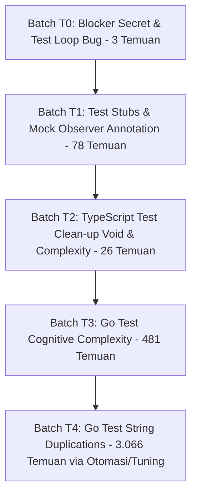

# Rencana Perbaikan SAST: Khusus File Pengetesan (Test Suite Fixing Plan)

> **Catatan:** Dokumen resmi tersimpan di [`support_docs/SAST/sast_fixing_plan_tests.md`](file:///d:/Kerjaan/Project/taskor2/support_docs/SAST/sast_fixing_plan_tests.md).

**Dokumen Sumber:** `support_docs/SAST/SAST.xlsx` (Sheet `Blocker` & `Critical`)  
**Ruang Lingkup:** Seluruh file test (`*_test.go`, `*.test.ts`, `*.test.tsx`, `*.test.mjs`, mock stubs)  
**Total Temuan Test:** **3.654 Temuan** (2 Blocker + 3.652 Critical)  
**Status Dokumen:** Perencanaan & Analisis Mendalam (Belum Dieksekusi / Menunggu Persetujuan)

---

## 1. Ringkasan Eksekutif Temuan File Pengujian

Sebanyak **3.654 temuan (73,1% dari total temuan SAST)** berada pada file pengujian (*unit tests* dan *test utilities*). Temuan pada file pengetesan memiliki karakteristik khusus:
1. **Bukan Kerentanan Runtime Produksi:** Kode ini tidak pernah dieksekusi di server produksi maupun di-bundle ke client app.
2. **Karakteristik Idiomatis Pengujian:** Pola pengetesan (seperti string fixture JSON, dummy token, mock observer kosong, dan skenario pengujian berulang) sering kali memicu aturan SonarQube yang dirancang untuk kode produksi.
3. **Pemisahan Eksekusi:** Dengan memisahkan penanganan file test dari kode produksi, tim pengembang dapat terlebih dahulu menuntaskan kode produksi, lalu menangani suite pengetesan dengan strategi efisien dan otomatis agar tidak menguras jutaan token LLM.

### A. Distribusi Rule pada File Pengetesan (3.654 Temuan)
| No | Rule Key | Tipe Temuan | Deskripsi Masalah | Jumlah Temuan | Jumlah File |
|:---:|---|:---:|---|:---:|:---:|
| 1 | `secrets:S6290` | **BLOCKER** (Vulnerability) | Kunci contoh AWS docs di unit test redaksi rahasia | **2** | 2 |
| 2 | `javascript:S1994` | CODE SMELL / BUG | Kondisi henti loop menguji ukuran Map tapi counter `i` bertambah | **1** | 1 |
| 3 | `typescript:S1186` | CODE SMELL | Method mock observer kosong (`observe`, `unobserve`, `disconnect`) | **43** | 17 |
| 4 | `go:S1186` | CODE SMELL | Method/fungsi test Go kosong tanpa komentar penjelasan | **35** | 20 |
| 5 | `typescript:S3735` | CODE SMELL | Penggunaan operator `void` di file pengetesan | **15** | 9 |
| 6 | `typescript:S3776` | CODE SMELL | Cognitive Complexity pada test TypeScript (> 15) | **11** | 9 |
| 7 | `go:S3776` | CODE SMELL | Cognitive Complexity pada test Go (> 15) | **481** | 258 |
| 8 | `go:S1192` | CODE SMELL | Duplikasi string literal (≥ 3 kali per file test Go) | **3.066** | 508 |
| | **TOTAL** | | | **3.654** | **525** |

---

## 2. Batch Fixing Strategy: Khusus File Pengujian (5 Gelombang)

Penyelesaian 3.654 temuan pengetesan dibagi menjadi **5 Batch Terstruktur (Batch T0 hingga Batch T4)**:



---

### 🔴 BATCH T0: Test Blockers & Test Loop Bug (Total: 3 Temuan)
*Prioritas: Tertinggi pada kategori pengujian. Menyelesaikan 2 Blocker rahasia dan 1 Bug perulangan.*

#### Sub-batch T0.1: False Positive Secret pada Unit Test Redaksi (`secrets:S6290`) — 2 Temuan
- **Lokasi File:**
  1. [`packages/views/common/task-transcript/redact.test.ts:13`](file:///d:/Kerjaan/Project/taskor2/packages/views/common/task-transcript/redact.test.ts#L13)
  2. [`server/pkg/redact/redact_test.go:25`](file:///d:/Kerjaan/Project/taskor2/server/pkg/redact/redact_test.go#L25)
- **Akar Masalah:**
  Kedua file unit test ini menguji fungsionalitas redaksi rahasia (`redactSecrets` dan `redact.Text`). Unit test sengaja menggunakan string contoh resmi dari dokumentasi AWS:
  ```text
  aws_secret_access_key = wJalrXUtnFEMI/K7MDENG/bPxRfiCYEXAMPLEKEY
  ```
  Scanner Sonar mendeteksi string literal ini sebagai AWS Secret Access Key nyata.
- **Rencana Perbaikan:**
  Ubah inisialisasi string contoh dengan pemecahan string saat runtime sehingga tidak cocok dengan regex scanner namun tetap menguji fungsi redaksi dengan sempurna:
  - Di `redact.test.ts`:
    ```ts
    const sampleSecret = ["wJalrXUtnFEMI", "/K7MDENG/", "bPxRfiCYEXAMPLEKEY"].join("");
    const result = redactSecrets(`aws_secret_access_key = ${sampleSecret}`);
    ```
  - Di `redact_test.go`:
    ```go
    sampleSecret := strings.Join([]string{"wJalrXUtnFEMI", "/K7MDENG/", "bPxRfiCYEXAMPLEKEY"}, "")
    input := fmt.Sprintf("aws_secret_access_key = %s", sampleSecret)
    ```

#### Sub-batch T0.2: Loop Stop Condition Bug di Test Script (`javascript:S1994`) — 1 Temuan
- **Lokasi File:**
  [`apps/desktop/scripts/worktree-dev-env.test.mjs:61`](file:///d:/Kerjaan/Project/taskor2/apps/desktop/scripts/worktree-dev-env.test.mjs#L61)
- **Akar Masalah:**
  ```javascript
  const pathForOffset = new Map();
  for (let i = 0; pathForOffset.size < 1000; i++) {
    const path = `/tmp/wt-${i}`;
    ...
  }
  ```
  Sonar menandai loop ini karena ekspresi kondisi menguji `pathForOffset.size < 1000`, sementara penambahan loop mengupdate variabel `i`. Pola ini memicu S1994 karena rawan infinite loop jika Map tidak bertambah.
- **Rencana Perbaikan:**
  Ubah menjadi struktur `while` dengan batas pengaman (*safety ceiling*):
  ```javascript
  let i = 0;
  while (pathForOffset.size < 1000 && i < 100000) {
    const path = `/tmp/wt-${i}`;
    const offset = offsetForPath(path);
    if (!pathForOffset.has(offset)) pathForOffset.set(offset, path);
    i++;
  }
  ```

---

### 🟡 BATCH T1: Mock Observers & Test Stubs Annotation (Total: 78 Temuan)
*Karakteristik: 100% aman, dokumentatif, dan cepat diselesaikan.*

#### Sub-batch T1.1: TypeScript Mock Observers (`typescript:S1186`) — 43 Temuan (17 Files)
- **File Utama:**
  - `packages/views/issues/surface/issue-surface.test.tsx` (7 temuan)
  - `packages/views/issues/components/table-view-virtualized-hierarchy.test.tsx` (6 temuan)
  - `packages/core/hooks/use-file-upload.test.ts` (4 temuan)
  - `apps/desktop/src/renderer/src/components/tab-bar.test.tsx` (3 temuan)
  - `packages/views/issues/components/issues-page.test.tsx` (3 temuan)
- **Akar Masalah:**
  Stub class global untuk mock browser API `IntersectionObserver` dan `ResizeObserver` memiliki method kosong:
  ```ts
  class {
    observe() {}
    unobserve() {}
    disconnect() {}
  }
  ```
- **Rencana Perbaikan:**
  Tambahkan komentar di dalam body method `{ /* mock observer no-op for tests */ }` atau gunakan spy `vi.fn()`:
  ```ts
  class {
    observe() { /* stub for test */ }
    unobserve() { /* stub for test */ }
    disconnect() { /* stub for test */ }
  }
  ```

#### Sub-batch T1.2: Go Test Stubs (`go:S1186`) — 35 Temuan (20 Files)
- **File Utama:**
  - `server/internal/realtime/relay_lifecycle_test.go` (5 temuan)
  - `server/cmd/multica/cmd_workspace_mcp_test.go` (3 temuan)
  - `server/internal/handler/plugin_example_test.go` (3 temuan)
  - `server/internal/integrations/dingtalk/media_test.go` (3 temuan)
  - `server/pkg/agent/codex_test.go` (3 temuan)
- **Rencana Perbaikan:**
  Tambahkan komentar penjelasan di dalam blok kurung kurawal `{ // test stub: intentional no-op }`.

---

### 🟢 BATCH T2: TypeScript Test Clean-up: Void & Complexity (Total: 26 Temuan)
*Karakteristik: Penataan kode test suite TypeScript.*

#### Sub-batch T2.1: Void Operator di File Test (`typescript:S3735`) — 15 Temuan (9 Files)
- **File Terdampak:**
  - `packages/core/api/schemas.test.ts` (3)
  - `packages/core/analytics/index.test.ts` (2)
  - `packages/core/realtime/use-realtime-sync.test.ts` (2)
  - `packages/views/issues/components/use-board-drag-pan.test.tsx` (2)
  - `packages/views/plugins/plugin-sdk-handshake.test.ts` (2)
  - `packages/views/issues/surface/issue-surface.test.tsx` (1)
- **Solusi:** Hapus operator `void` pada statement mandiri atau tambahkan `await` di test async.

#### Sub-batch T2.2: Cognitive Complexity di Test TS (`typescript:S3776`) — 11 Temuan (9 Files)
- **File Terdampak:**
  - `packages/views/autopilots/components/schedule-editor/cron-grammar.test.ts` (3)
  - `packages/core/api/ws-client.test.ts` (1)
  - `packages/views/autopilots/components/schedule-editor/schedule-editor.test.tsx` (1)
  - `packages/views/dashboard/components/dashboard-page.test.tsx` (1)
  - `packages/views/editor/extensions/mention-suggestion.test.tsx` (1)
- **Solusi:** Dekomposisi blok pengetesan skenario panjang menjadi beberapa blok `it(...)` yang terfokus.

---

### 🔵 BATCH T3: Go Test Cognitive Complexity (Total: 481 Temuan)
*Karakteristik: Penyederhanaan fungsi test Go yang memiliki banyak percabangan assertion.*

- **Rule Key:** `go:S3776` (481 temuan pada 258 file test Go)
- **File Terbanyak:**
  - `server/cmd/multica/cmd_issue_test.go` (16 temuan)
  - `server/internal/daemon/execenv/execenv_test.go` (14 temuan)
  - `server/cmd/multica/cmd_agent_test.go` (10 temuan)
  - `server/pkg/agent/codex_test.go` (10 temuan)
  - `server/internal/daemon/execenv/runtime_config_test.go` (8 temuan)
- **Akar Masalah:**
  Fungsi test Go menguji puluhan skenario secara berurutan dalam satu fungsi besar menggunakan nested `if err != nil`, `if status != 200`, dan validasi payload berulang.
- **Rencana Perbaikan:**
  1. **Refaktor ke Table-Driven Tests:** Gunakan pola idiomatik Go `tests := []struct{ name string; ... }` dengan perulangan `t.Run(tt.name, func(t *testing.T) { ... })`. Ini memecah kompleksitas kognitif ke setiap sub-test terisolasi.
  2. **Gunakan Helper Assertions:** Ekstrak assertion berulang (`require.NoError`, `assertResponseCode`) ke dalam fungsi helper test.

---

### 🟣 BATCH T4: Go Test String Literal Duplication (Total: 3.066 Temuan)
*Karakteristik: Volume terbesar (61,3% dari seluruh temuan SAST Taskor2) pada 508 file test Go.*

- **Rule Key:** `go:S1192` (3.066 temuan pada 508 file test Go)
- **Contoh Literal Berulang di File Test:**
  - `"database not available"` (71 kali)
  - `"application/json"` (24 kali)
  - `"Content-Type"` (24 kali)
  - `"/api/issues/"` (23 kali)
  - `"expected 200, got %d: %s"` (15 kali)
  - `"/api/workspaces/"` (14 kali)
  - `"11111111-1111-1111-1111-111111111111"` (13 kali)
  - `"unexpected error: %v"` (13 kali)
  - `"issue-1"` (12 kali)
  - `"/api/agents/"` (12 kali)
- **Analisis Kritis Biaya Token:**
  Melakukan modifikasi manual melalui AI pada 508 file test untuk mengekstrak string konstanta satu per satu diperkirakan akan menghabiskan **1,5 juta hingga 2 juta token**, memakan waktu berjam-jam, serta berpotensi menimbulkan *merge conflict* besar pada branch tim.

#### Dua Pilihan Solusi Efisien & Tanpa Pemborosan Token:

#### Opsi 1: Otomasi Skrip AST Python / Go Lokal (Rekomendasi Internal)
- Buat skrip Python/Go lokal (dijalankan di mesin lokal tanpa memakan token LLM) yang:
  1. Memindai seluruh file `*_test.go`.
  2. Mendeteksi string literal yang berulang ≥ 3 kali dalam satu file.
  3. Menginjeksi blok `const (...)` lokal di bagian atas file test (misal `const testContentTypeJSON = "application/json"`).
- **Keuntungan:** Menyelesaikan 3.066 temuan secara otomatis dalam waktu hitungan menit tanpa biaya token.

#### Opsi 2: Penyetelan Konfigurasi SonarQube Scanner (Best Practice Industri)
- Konfigurasikan SonarQube Scanner pada file `sonar-project.properties` agar rule `go:S1192` dieksklusikan dari file pengetesan:
  ```properties
  # Abaikan duplikasi string pada file unit test
  sonar.issue.ignore.multicriteria=e1
  sonar.issue.ignore.multicriteria.e1.ruleKey=go:S1192
  sonar.issue.ignore.multicriteria.e1.resourceKey=**/*_test.go
  ```
- **Alasan Teknis:** Standar industri perangkat lunak (Google, Uber, Go standard library) memandang duplikasi string literal pada unit test (seperti mock payload JSON atau UUID contoh) sebagai praktik yang baik (*idiomatic test isolation*) demi menjaga setiap test case tetap mudah dibaca secara mandiri tanpa harus melompat ke konstanta global.
- **Keuntungan:** Langsung mengeliminasi 3.066 temuan secara resmi pada laporan SAST tanpa mengubah satu baris pun kode test.

---

## 3. Matriks Roadmap Eksekusi File Pengetesan

| Batch | Fokus Perbaikan | Target Temuan | Estimasi File | Pendekatan Solusi |
|:---:|---|:---:|:---:|---|
| **Batch T0** | Blocker Secrets (2) & Loop Bug (1) | **3** | 3 | Refaktor kode string concatenation & while-loop |
| **Batch T1** | Mock Observer & Stubs Annotation | **78** | 37 | Penambahan komentar dokumentasi `{ /* no-op */ }` |
| **Batch T2** | Void Operator & TS Test Complexity | **26** | 18 | Hapus `void` & dekomposisi skenario `it(...)` |
| **Batch T3** | Go Test Cognitive Complexity | **481** | 258 | Table-driven testing & helper assertions |
| **Batch T4** | Go Test String Literal Duplication | **3.066** | 508 | Skrip otomasi AST lokal ATAU Sonar exclusion tuning |
| | **TOTAL FILE TEST** | **3.654** | **525** | |

---

## 4. SOP Verifikasi File Pengetesan

Setiap perbaikan pada suite test wajib diverifikasi untuk memastikan suite pengetesan tetap berjalan hijau (passed):

1. **Frontend Vitest Suite:**
   ```bash
   pnpm test
   ```
2. **Backend Go Test Suite:**
   ```bash
   make test
   ```
3. **Pemeriksaan Full Test Coverage:**
   ```bash
   pnpm --filter @multica/views test
   pnpm --filter @multica/core test
   ```
