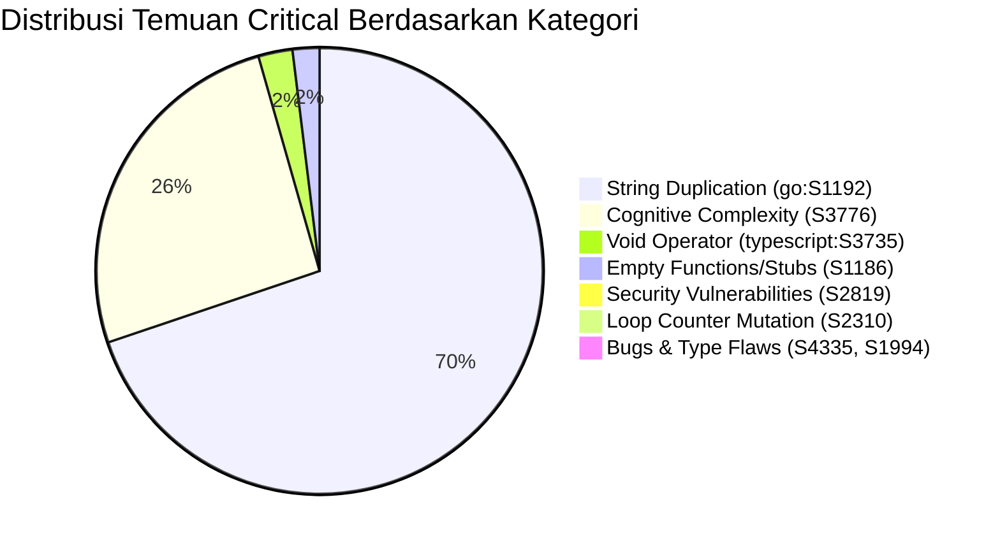

# Rencana Perbaikan Keamanan & Kualitas Kode SAST (SAST Fixing Plan)
**Dokumen Sumber:** `support_docs/SAST/SAST.xlsx` (Sheet `Blocker` & `Critical`)  
**Total Temuan Teridentifikasi:** 5.001 Temuan (3 Blocker, 4.998 Critical)  
**Status Dokumen:** Perencanaan & Analisis Mendalam (Belum Dieksekusi / Pending Review)

---

## 1. Ringkasan Eksekutif & Identifikasi Temuan SAST

Berdasarkan hasil pemindaian Static Application Security Testing (SAST) yang tercatat pada `support_docs/SAST/SAST.xlsx`, teridentifikasi sebanyak **5.001 total temuan** yang terbagi dalam 2 tingkat keparahan:
- **Sheet Blocker:** **3 temuan** (2 VULNERABILITY, 1 CODE SMELL)
- **Sheet Critical:** **4.998 temuan** (8 VULNERABILITY, 2 BUG, 4.988 CODE SMELL)

### A. Distribusi Berdasarkan Bahasa & Komponen Proyek
| Komponen / Directory | Bahasa Utama | Jumlah Temuan Critical | Persentase |
|---|---|:---:|:---:|
| `server/` (Backend Go) | Go | 4.521 | 90,4% |
| `packages/views/` (Shared UI Pages) | TypeScript/TSX | 306 | 6,1% |
| `packages/core/` (Business Logic & State) | TypeScript | 70 | 1,4% |
| `apps/mobile/` (Mobile App Expo) | TypeScript/TSX | 42 | 0,8% |
| `apps/desktop/` (Electron Desktop) | TypeScript/JavaScript | 37 | 0,7% |
| `packages/ui/` (Atomic UI Base) | TypeScript/TSX | 14 | 0,3% |
| `examples/` (Plugin Examples) | JavaScript | 7 | 0,1% |
| `packages/plugin-sdk/` | TypeScript | 1 | < 0,1% |
| **Total** | | **4.998** | **100%** |

### B. Distribusi File Pengujian (Test) vs Kode Produksi (Production)
Fakta penting hasil analisis: **sebagian besar temuan (71,9%) berasal dari file Unit Test**, bukan kode yang berjalan di lingkungan produksi:
- **File Test (`*_test.go`, `*.test.ts`, `*.test.mjs`):** **3.617 temuan (72,4%)**
- **File Production (`.go`, `.ts`, `.tsx`, `.js`):** **1.381 temuan (27,6%)**

---

## 2. Analisis & Rencana Penyelesaian BLOCKER (3 Temuan)

Sheet `Blocker` memuat 3 temuan dengan prioritas absolut yang harus diselesaikan terlebih dahulu:

| No | Rule Key | Lokasi File & Baris | Tipe | Pesan Sonar | Akar Masalah & Rencana Perbaikan |
|:---:|---|---|:---:|---|---|
| **B-1** | `secrets:S6290` | `packages/views/common/task-transcript/redact.test.ts (13)` | VULNERABILITY | *Make sure this AWS Secret Access Key is not disclosed.* | **Akar Masalah:** Unit test untuk modul redaksi rahasia (`redactSecrets`) menggunakan contoh string kunci AWS statis dari dokumentasi publik AWS (`wJalrXUtnFEMI/K7MDENG/bPxRfiCYEXAMPLEKEY`). Sonar mendeteksinya sebagai kebocoran AWS Secret Access Key asli.<br>**Solusi:** Pecah string atau gunakan konstruksi dinamis/Base64 decode (sebagaimana dilakukan pada baris 30 untuk GitHub PAT: `["wJalrXUtnFEMI", "/K7MDENG/", "bPxRfiCYEXAMPLEKEY"].join("")`) sehingga scanner tidak mencocokkan signature regex secret riil. |
| **B-2** | `typescript:S3516` | `packages/views/editor/extensions/file-upload.ts (96)` | CODE SMELL | *Refactor this function to not always return the same value.* | **Akar Masalah:** Fungsi `insertUploadPlaceholder(editor, upload)` memiliki return type `boolean`, namun kedua percabangan di dalamnya (baris 102 saat node sudah ada, dan baris 117 setelah insert) sama-sama mengembalikan `return true;`. Fungsi tidak pernah mengembalikan `false`.<br>**Solusi:** Refaktor nilai kembalian agar semantik dan fungsional: return `false` jika `findUploadNode` sudah ada (artinya tidak ada placeholder baru yang di-insert), return `false` jika editor belum siap (`!editor?.view`), dan return `true` jika placeholder berhasil di-insert. Sesuaikan pengetesan di `file-upload.test.ts`. |
| **B-3** | `secrets:S6290` | `server/pkg/redact/redact_test.go (25)` | VULNERABILITY | *Make sure this AWS Secret Access Key is not disclosed.* | **Akar Masalah:** Serupa dengan B-1, fungsi pengujian `TestRedactAWSSecretKey` di Go menguji redaksi string rahasia menggunakan contoh AWS docs key statis.<br>**Solusi:** Gunakan pemecahan string via `strings.Join([]string{"wJalrXUtnFEMI", "/K7MDENG/", "bPxRfiCYEXAMPLEKEY"}, "")` atau decoding byte slice saat runtime pengujian, sehingga lolos scan regex secret tanpa merusak validasi fungsi redaksi `redact.Text()`. |

---

## 3. Kategorisasi Masalah CRITICAL (4.998 Temuan)

Seluruh 4.998 temuan Critical berasal dari **13 Rule Keys**. Dari hasil audit mendalam, temuan dikelompokkan ke dalam **7 Kategori Teknis**:



### Rincian 13 Rules:
| No | Rule Key | Deskripsi Singkat | Tipe | Total | File Test | File Prod | Total File |
|:---:|---|---|:---:|:---:|:---:|:---:|:---:|
| 1 | `go:S1192` | Duplikasi string literal (≥ 3 kali dalam 1 file) | CODE SMELL | **3.478** | 3.066 | 412 | 630 |
| 2 | `go:S3776` | Cognitive Complexity pada method Go (> 15) | CODE SMELL | **989** | 481 | 508 | 485 |
| 3 | `typescript:S3776` | Cognitive Complexity pada function TypeScript (> 15) | CODE SMELL | **294** | 11 | 283 | 200 |
| 4 | `typescript:S3735` | Penggunaan operator `void` yang berlebihan | CODE SMELL | **123** | 15 | 108 | 66 |
| 5 | `go:S1186` | Fungsi Go kosong tanpa komentar penjelasan | CODE SMELL | **54** | 35 | 19 | 34 |
| 6 | `typescript:S1186` | Method TS/JS kosong tanpa isi/komentar (`observe`) | CODE SMELL | **43** | 43 | 0 | 17 |
| 7 | `javascript:S2819` | Validasi origin atau targetOrigin pada `postMessage` | VULNERABILITY | **6** | 0 | 6 | 3 |
| 8 | `typescript:S2310` | Assignment/modifikasi variabel counter loop `i` di loop | CODE SMELL | **4** | 0 | 4 | 2 |
| 9 | `typescript:S4335` | Tipe kosong / perpotongan tipe tanpa member (`string & {}`) | BUG | **2** | 0 | 2 | 2 |
| 10 | `typescript:S2819` | Tentukan targetOrigin pada `postMessage` | VULNERABILITY | **2** | 0 | 2 | 2 |
| 11 | `javascript:S2310` | Assignment variabel counter loop `i` di loop | CODE SMELL | **1** | 0 | 1 | 1 |
| 12 | `javascript:S1994` | Kondisi berhenti loop menguji variabel berbeda dari inkremen | CODE SMELL / BUG | **1** | 1 | 0 | 1 |
| 13 | `javascript:S3776` | Cognitive Complexity pada file JavaScript plugin (> 15) | CODE SMELL | **1** | 0 | 1 | 1 |
| | **Total** | | | **4.998** | **3.617** | **1.381** | **686** |

---

## 4. Batch Fixing Strategy (Strategi Perbaikan Bertahap Anti-Boros Token)

Karena volume temuan mencapai hampir 5.000, eksekusi secara acak atau sekaligus akan menyebabkan **pemborosan token konteks**, **risiko regresi kode tinggi**, dan **sulitnya pelacakan status**.

Oleh karena itu, penyelesaian dibagi menjadi **5 Batch Terstruktur (Wave 0 hingga Wave 4)** berdasarkan rasio dampak keamanan, risiko perubahan, dan kemudahan otomasi:

---

### 🟢 BATCH 0: Quick Wins — Keamanan & Bug Logika (Total: 16 Temuan)
*Karakteristik: Dampak keamanan sangat tinggi, file sedikit, risiko regresi rendah, hemat token.*

#### Sub-batch 0.1: Security Vulnerability `postMessage` (`javascript:S2819` & `typescript:S2819`) — 8 Temuan
- **File Terdampak:**
  - `packages/plugin-sdk/index.ts (131)`
  - `packages/views/plugins/surface-bridge.ts (144)`
  - `examples/plugins/hello-panel/ui/main.js (16, 48)`
  - `examples/plugins/release-checklist/ui/main.js (16, 48)`
  - `examples/plugins/triage-notify/ui/main.js (17, 43)`
- **Akar Masalah:** Penggunaan `postMessage(data, "*")` atau ketiadaan validasi eksplisit `event.origin` saat menangani pesan iframe.
- **Rencana Perbaikan:** 
  - Pada `packages/plugin-sdk` & `surface-bridge`: Tentukan spesifik origin target jika diketahui atau tambahkan validasi `event.origin` yang diperbolehkan sesuai protokol bridge sandboxed iframe.
  - Pada contoh plugin: Tambahkan pengecekan `event.origin` sebelum memproses `event.data`.

#### Sub-batch 0.2: Bug Logika & Tipe Data (`typescript:S4335` & `javascript:S1994`) — 3 Temuan
- **File Terdampak:**
  - `packages/core/types/agent.ts (312)`: `failure_reason?: TaskFailureReason | (string & {}) | ""`
  - `packages/core/types/issue.ts (31)`: `export type IssueStatus = IssueStatusCategory | (string & {})`
  - `apps/desktop/scripts/worktree-dev-env.test.mjs (61)`: `for (let i = 0; pathForOffset.size < 1000; i++)`
- **Akar Masalah:**
  - Di `agent.ts` & `issue.ts`: Konstruksi `(string & {})` digunakan untuk autocomplete union loose string. SonarQube menganggap `{}` sebagai empty type tanpa member.
  - Di `worktree-dev-env.test.mjs`: Loop `for` menggunakan counter `i` tapi kondisinya `pathForOffset.size < 1000`.
- **Rencana Perbaikan:**
  - Di types: Ganti tipe autocomplete union menjadi `(string & Record<never, never>)` yang merupakan pola standar TypeScript yang tidak memicu S4335 namun tetap menjaga fungsionalitas autocomplete IDE.
  - Di test mjs: Ubah menjadi `while (pathForOffset.size < 1000)` dengan penambahan safety guard `i < 100000`.

#### Sub-batch 0.3: Loop Counter Mutation Anti-Pattern (`typescript:S2310` & `javascript:S2310`) — 5 Temuan
- **File Terdampak:**
  - `packages/ui/markdown/linkify.ts (197, 206)`
  - `packages/views/runtimes/components/runtime-profile-catalog.ts (122, 146)`
  - `apps/desktop/scripts/package.mjs (242)`
- **Akar Masalah:** Variabel indeks loop `i` dimodifikasi langsung di dalam blok `for (let i = 0; ...; i++)` untuk melompati token karakter.
- **Rencana Perbaikan:** Refaktor struktur loop dari `for` menjadi `while (i < len)` yang secara semantik memang ditujukan untuk parser/tokenizer dengan step dinamis.

---

### 🟡 BATCH 1: Empty Stubs & Comment Annotations (Total: 97 Temuan)
*Karakteristik: Perubahan bersifat dokumentatif, risiko regresi 0%, sangat cepat dieksekusi.*

#### Sub-batch 1.1: TypeScript Test Observer Stubs (`typescript:S1186`) — 43 Temuan (17 Files)
- **File Terdampak (100% file test):**
  - `packages/views/issues/surface/issue-surface.test.tsx` (7 temuan)
  - `packages/views/issues/components/table-view-virtualized-hierarchy.test.tsx` (6 temuan)
  - `packages/core/hooks/use-file-upload.test.ts` (4 temuan)
  - `apps/desktop/src/renderer/src/components/tab-bar.test.tsx` (3 temuan)
  - File mock observer lainnya.
- **Akar Masalah:** Mocking objek browser seperti `IntersectionObserver` dan `ResizeObserver` memiliki method kosong: `observe() {}`, `unobserve() {}`, `disconnect() {}`.
- **Rencana Perbaikan:** Tambahkan komentar penjelas di dalam method `{ /* mock observer no-op for tests */ }` atau gunakan mock spy Vitest `vi.fn()`.

#### Sub-batch 1.2: Go Empty Functions (`go:S1186`) — 54 Temuan (34 Files)
- **File Terdampak:**
  - 19 temuan di file produksi Go (misal: `cmd_daemon_unix.go`, `isolation_unix.go`, `proc_windows.go`, `metrics.go`). Seluruhnya merupakan stub cross-platform OS atau interface no-op.
  - 35 temuan di file test Go (misal: `relay_lifecycle_test.go`, mock handlers).
- **Akar Masalah:** Fungsi stub antarmuka atau no-op OS tidak memiliki komentar dalam blok `{}`.
- **Rencana Perbaikan:** Tambahkan komentar eksplisit di dalam blok fungsi: `// no-op: intentionally empty for this OS platform / mock interface`.

---

### 🔵 BATCH 2: TypeScript Void Operator Removal (Total: 123 Temuan)
*Karakteristik: Standardisasi pemanggilan asynchronous unawaited promise (`typescript:S3735`).*

- **Cakupan:** 123 temuan pada 66 file (108 di produksi, 15 di test).
- **Contoh File Teratas:**
  - `packages/views/agents/create/use-builder-session.ts` (6)
  - `packages/views/settings/components/billing-tab.tsx` (6)
  - `apps/mobile/app/(auth)/verify.tsx` (5)
  - `apps/desktop/src/renderer/src/platform/client-usage-reporter.tsx` (4)
  - `packages/core/client-usage/reporter.tsx` (4)
  - `apps/desktop/src/main/index.ts` (3)
- **Akar Masalah:** Operator `void` digunakan sebelum pemanggilan promise unawaited (misal: `void window.loadURL(...)` atau `void mutate()`) untuk membungkam linter TypeScript. SonarQube menganggap penggunaan operator `void` ini tidak perlu / code smell.
- **Rencana Perbaikan:** Hapus operator `void` dari statement ekspresi mandiri (`window.loadURL(...)`), atau jika diperlukan error handling tangani dengan `.catch(...)` yang aman.

---

### 🟣 BATCH 3: Go String Literal Duplications (Total: 3.478 Temuan)
*Karakteristik: Volume terbesar (69,6% dari total temuan). Perlu pemisahan tegas antara Produksi dan Test untuk mencegah pemborosan token.*

#### Sub-batch 3.1: Go Production String Duplications — 412 Temuan (122 Files)
- **Fokus Utama:** Kode produksi yang dikompilasi ke binary backend.
- **Contoh String & Lokasi:**
  - Flag CLI CLI Multica: `"workspace id"` (22 kali), `"Output format: table or json"` (14 kali) di `cmd_agent.go`, `cmd_issue.go`, `cmd_daemon.go`.
  - HTTP Handler Error Messages: `"invalid request body"` (19 kali), `"database not available"` di `issue.go`, `chat.go`, `skill.go`.
  - Header & MIME strings: `"Content-Type"`, `"application/json"` di `router.go`.
- **Rencana Perbaikan:**
  1. Buat konstanta terpusat di masing-masing package (misal: `const errInvalidRequestBody = "invalid request body"` di package `handler`).
  2. Gunakan konstanta standar library Go `http.HeaderContentType` atau `server/pkg/constants` untuk MIME types.
  3. Kelompokkan konstanta flag CLI di `server/cmd/multica/flags.go`.

#### Sub-batch 3.2: Go Test Files String Duplications — 3.066 Temuan (508 Files)
- **Analisis Kritis:** 3.066 temuan hanya berada di file `*_test.go`. Mendefinisikan ribuan konstanta manual di 508 file test satu per satu akan menghabiskan jutaan token konteks dan mengaburkan keterbacaan skenario pengetesan.
- **Strategi Efisien Berjenjang:**
  1. **Opsi Rekomendasi 1 (Otomasi Script AST):** Buat script internal Python/Go untuk secara otomatis mengekstrak literal yang berulang ≥ 3 kali per file test ke blok `const (...)` di bagian atas file test yang bersangkutan.
  2. **Opsi Rekomendasi 2 (SonarQube Scope Tuning):** Sesuaikan konfigurasi SonarQube agar rule `go:S1192` dieksklusikan dari direktori test (`sonar.issue.ignore.multicriteria` untuk pola `**/*_test.go`). Ini adalah praktik industri terbaik (best practice) karena duplikasi string di unit test (seperti payload JSON mock atau assertion string) adalah hal wajar dan membantu isolasi pengetesan.

---

### 🔴 BATCH 4: Cognitive Complexity Refactoring (Total: 1.284 Temuan)
*Karakteristik: Tingkat kesulitan tertinggi. Membutuhkan pemahaman mendalam atas logika bisnis inti Taskor2 agar tidak menimbulkan bug fungsional.*

- **Distribusi:**
  - `go:S3776`: 989 temuan (508 di produksi, 481 di test)
  - `typescript:S3776`: 294 temuan (283 di produksi, 11 di test)
  - `javascript:S3776`: 1 temuan (`release-checklist/ui/main.js`)

#### Strategi Penyelesaian Bertahap (Prioritas Berdasarkan Skor Kompleksitas):
1. **Fase 4.1: Ekstrem Kompleksitas di Go Backend (Skor > 100)**
   - `server/internal/handler/daemon.go:1890` (Skor 566)
   - `server/internal/daemon/daemon.go:6308` (Skor 211)
   - `server/internal/handler/issue.go:3856` (Skor 164)
   - `server/cmd/server/router.go:318` (Skor 148)
   - `server/pkg/agent/codex.go:936` (Skor 147)
   - *Teknik Refaktor:* Dekomposisi method raksasa menjadi sub-fungsi pembantu (*helper functions*), ekstrak blok *switch-case* atau *validation pipeline* ke dalam handler terpisah.
2. **Fase 4.2: Ekstrem Kompleksitas di Frontend TypeScript (Skor > 100)**
   - `packages/core/realtime/use-realtime-sync.ts:748` (Skor 203)
   - `packages/views/issues/surface/use-issue-surface-controller.ts:201` (Skor 184)
   - `packages/views/settings/components/billing-tab.tsx:217` (Skor 159)
   - `packages/views/editor/use-coordinated-uploads.ts:241` (Skor 118)
   - `packages/views/chat/components/use-chat-controller.ts:204` (Skor 117)
   - *Teknik Refaktor:* Ekstraksi custom hooks kecil, pisahkan handler aksi dari reducer state, gunakan strategi pattern untuk pengganti percabangan bertingkat.
3. **Fase 4.3: Kompleksitas Sedang di Kode Produksi (Skor 16 - 99)**
   - Lakukan refaktorisasi bertahap per modul bisnis (`issues`, `agents`, `daemon`, `auth`).
4. **Fase 4.4: Kompleksitas pada File Unit Test (481 Go Tests & 11 TS Tests)**
   - Evaluasi penggunaan *table-driven tests* di Go untuk menyederhanakan rangkaian `if-else` assertion.

---

## 5. Matriks Rencana Eksekusi (Roadmap)

| Gelombang / Batch | Cakupan Rule | Estimasi Temuan Selesai | Estimasi File | Tingkat Risiko | Prioritas Eksekusi |
|---|---|:---:|:---:|:---:|:---:|
| **Tahap Blocker** | `secrets:S6290`, `typescript:S3516` | **3** | 3 | Rendah | **Pertama (Immediate)** |
| **Batch 0 (Quick Wins)** | `S2819` (Vulnerability), `S4335` (Bug), `S1994` (Bug), `S2310` | **16** | 10 | Rendah | **Kedua** |
| **Batch 1 (Stubs/Comments)** | `typescript:S1186`, `go:S1186` | **97** | 51 | Sangat Rendah | **Ketiga** |
| **Batch 2 (Void Operator)** | `typescript:S3735` | **123** | 66 | Sangat Rendah | **Keempat** |
| **Batch 3A (Go Prod String)** | `go:S1192` (Production) | **412** | 122 | Rendah - Sedang | **Kelima** |
| **Batch 3B (Go Test String)** | `go:S1192` (Unit Tests) | **3.066** | 508 | Rendah (Otomasi/Tuning) | **Keenam** |
| **Batch 4 (Cognitive Complexity)**| `go:S3776`, `typescript:S3776`, `javascript:S3776` | **1.284** | 686 | Tinggi | **Bertahap per Modul** |

---

## 6. Prosedur Pengujian & Validasi Kualitas

Setiap kali satu batch selesai dikerjakan, serangkaian pengujian wajib dijalankan sebelum melanjutkan ke batch berikutnya:

1. **Frontend Typecheck & Linting:**
   ```bash
   pnpm typecheck
   pnpm lint
   ```
2. **Frontend Unit Tests (Vitest):**
   ```bash
   pnpm test
   ```
3. **Backend Go Verification:**
   ```bash
   make test
   ```
4. **Full Workspace Check:**
   ```bash
   make check
   ```

---

## 7. Rekomendasi Penyetelan Konfigurasi SonarQube Scanner

Untuk mencegah *noise* dan pembengkakan temuan yang tidak perlu di masa mendatang:
1. **Eksklusi `go:S1192` pada Test Files:** Duplikasi string pada file pengujian adalah pola umum (*idiomatic test fixtures*). Menambahkan exclusion rule untuk `**/*_test.go` akan **langsung memangkas 3.066 temuan (61,3% dari total temuan)** secara bersih tanpa memodifikasi kode.
2. **Eksklusi Test Files dari Cognitive Complexity `S3776`:** Fungsi pengujian yang panjang dengan banyak *sub-tests* sering kali melebihi ambang batas 15. Menyetel batas terpisah untuk test suite akan memangkas **492 temuan** tambahan.
