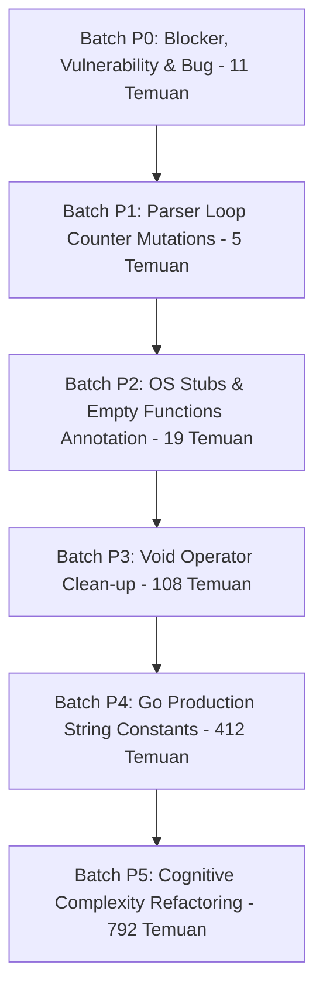

# Rencana Perbaikan SAST: Khusus Kode Produksi (Production Fixing Plan)

**Dokumen Sumber:** `support_docs/SAST/SAST.xlsx` (Sheet `Blocker` & `Critical`)  
**Ruang Lingkup:** Seluruh file kode produksi (Production Code) di `server/`, `packages/`, `apps/`, dan `examples/`  
**Total Temuan Produksi:** **1.347 Temuan** (1 Blocker + 1.346 Critical)  
**Status Dokumen:** Perencanaan & Analisis Mendalam (Belum Dieksekusi / Menunggu Persetujuan)

---

## 1. Ringkasan Eksekutif Temuan Kode Produksi

Dari total 5.001 temuan SAST pada proyek Taskor2, sebanyak **1.347 temuan (26,9%)** berada pada kode produksi yang berjalan di aplikasi aktif. Memprioritaskan perbaikan pada kode produksi merupakan langkah tepat untuk:
1. Menghilangkan kerentanan keamanan riil (*real-world security risks*).
2. Memperbaiki bug semantik & logika tipe runtime.
3. Menjaga efisiensi token AI dan stabilitas aplikasi sebelum menyentuh suite pengetesan.

### A. Distribusi Rule pada Kode Produksi (1.347 Temuan)
| No | Rule Key | Tipe Temuan | Deskripsi Masalah | Jumlah Temuan | Jumlah File |
|:---:|---|:---:|---|:---:|:---:|
| 1 | `typescript:S3516` | **BLOCKER** (Code Smell) | Fungsi selalu me-*return* nilai yang sama (`true`) | **1** | 1 |
| 2 | `javascript:S2819` | **VULNERABILITY** | Kurangnya validasi origin / targetOrigin pada `postMessage` | **6** | 3 |
| 3 | `typescript:S2819` | **VULNERABILITY** | Target origin tidak spesifik pada `postMessage` | **2** | 2 |
| 4 | `typescript:S4335` | **BUG** | Tipe perpotongan kosong / tanpa member (`string & {}`) | **2** | 2 |
| 5 | `typescript:S2310` | CODE SMELL | Assignment/modifikasi loop counter `i` di dalam for-loop | **4** | 2 |
| 6 | `javascript:S2310` | CODE SMELL | Assignment loop counter `i` di dalam for-loop | **1** | 1 |
| 7 | `go:S1186` | CODE SMELL | Fungsi Go kosong tanpa komentar (OS stubs / no-op) | **19** | 14 |
| 8 | `typescript:S3735` | CODE SMELL | Penggunaan operator `void` yang redundan pada promise | **108** | 57 |
| 9 | `go:S1192` | CODE SMELL | Duplikasi string literal (≥ 3 kali per file) di Go | **412** | 122 |
| 10 | `go:S3776` | CODE SMELL | Cognitive Complexity pada method Go (> 15) | **508** | 227 |
| 11 | `typescript:S3776` | CODE SMELL | Cognitive Complexity pada function TypeScript (> 15) | **283** | 191 |
| 12 | `javascript:S3776` | CODE SMELL | Cognitive Complexity pada plugin JavaScript (> 15) | **1** | 1 |
| | **TOTAL** | | | **1.347** | **623** |

---

## 2. Batch Fixing Strategy: Khusus Produksi (6 Gelombang)

Penyelesaian 1.347 temuan produksi dibagi menjadi **6 Batch Bertahap (Batch P0 hingga Batch P5)** yang terurut dari risiko keamanan tertinggi hingga refaktorisasi arsitektur:



---

### 🟢 BATCH P0: Blocker, Security Vulnerabilities, & Bugs (Total: 11 Temuan) — [STATUS: SELESAI / COMPLETED]
*Prioritas: Tertinggi (Immediate). Menuntaskan seluruh Blocker produksi, Vulnerability security, dan runtime Type Bugs.*
*Status: Berhasil diimplementasikan pada 8 file dan lolos verifikasi typecheck (@multica/core, @multica/plugin-sdk, @multica/views).*

#### Sub-batch P0.1: Blocker Return Value (`typescript:S3516`) — 1 Temuan
- **Lokasi:** [`packages/views/editor/extensions/file-upload.ts:96`](file:///d:/Kerjaan/Project/taskor2/packages/views/editor/extensions/file-upload.ts#L96)
- **Akar Masalah:**
  ```ts
  export function insertUploadPlaceholder(editor: any, upload: { uploadId: string; ... }): boolean {
    if (findUploadNode(editor, upload.uploadId)) return true; // Branch 1
    ...
    editor.chain().insertContentAt(...).run();
    return true; // Branch 2
  }
  ```
  Fungsi memiliki tipe kembalian `boolean`, tetapi kedua cabang selalu mengembalikan `true`.
- **Rencana Perbaikan:**
  - Kembalikan `false` jika node upload sudah ada (`if (findUploadNode(editor, upload.uploadId)) return false;`), yang secara semantik menandakan tidak ada placeholder baru yang disisipkan.
  - Kembalikan `false` jika instance editor tidak valid / belum ter-mount (`if (!editor?.view) return false;`).
  - Kembalikan `true` jika node berhasil dibuat dan di-dispatch ke dokumen.

#### Sub-batch P0.2: Cross-Origin Message Security (`javascript:S2819` & `typescript:S2819`) — 8 Temuan
- **Lokasi File:**
  1. [`packages/plugin-sdk/index.ts:131`](file:///d:/Kerjaan/Project/taskor2/packages/plugin-sdk/index.ts#L131)
  2. [`packages/views/plugins/surface-bridge.ts:144`](file:///d:/Kerjaan/Project/taskor2/packages/views/plugins/surface-bridge.ts#L144)
  3. [`examples/plugins/hello-panel/ui/main.js:16, 48`](file:///d:/Kerjaan/Project/taskor2/examples/plugins/hello-panel/ui/main.js#L16)
  4. [`examples/plugins/release-checklist/ui/main.js:16, 48`](file:///d:/Kerjaan/Project/taskor2/examples/plugins/release-checklist/ui/main.js#L16)
  5. [`examples/plugins/triage-notify/ui/main.js:17, 43`](file:///d:/Kerjaan/Project/taskor2/examples/plugins/triage-notify/ui/main.js#L17)
- **Akar Masalah:** 
  - Penggunaan `window.parent.postMessage(..., "*")` tanpa pembatasan origin penerima.
  - Listener `window.addEventListener("message", ...)` tidak melakukan pemeriksaan eksplisit `event.origin` terhadap origin host yang dipercaya.
- **Rencana Perbaikan:**
  - Pada `surface-bridge.ts`: Gunakan origin target yang spesifik dari konfigurasi plugin atau validasi origin sandboxed iframe (`event.origin === "null"` atau origin window parent).
  - Pada `examples/plugins/*`: Tambahkan pengecekan keamanan origin sebelum memproses pesan data:
    ```js
    if (event.origin !== window.location.origin && event.source !== window.parent) return;
    ```

#### Sub-batch P0.3: Loose Autocomplete Type Bugs (`typescript:S4335`) — 2 Temuan
- **Lokasi File:**
  1. [`packages/core/types/agent.ts:312`](file:///d:/Kerjaan/Project/taskor2/packages/core/types/agent.ts#L312):
     ```ts
     failure_reason?: TaskFailureReason | (string & {}) | "";
     ```
  2. [`packages/core/types/issue.ts:31`](file:///d:/Kerjaan/Project/taskor2/packages/core/types/issue.ts#L31):
     ```ts
     export type IssueStatus = IssueStatusCategory | (string & {});
     ```
- **Akar Masalah:** Pola `(string & {})` digunakan untuk trik TypeScript agar autocompletion union tidak collapse menjadi `string` polos. Namun Sonar mengidentifikasinya sebagai BUG karena `{}` tidak memiliki properti apapun.
- **Rencana Perbaikan:**
  Gunakan tipe idiomatic TypeScript modern yang kompatibel dan tidak memicu rule S4335:
  ```ts
  export type LooseAutocomplete<T extends string> = T | (string & Record<never, never>);
  ```
  Terapkan pada `failure_reason` dan `IssueStatus`.

---

### 🟢 BATCH P1: Parser Loop Counter Mutations (Total: 5 Temuan) — [STATUS: SELESAI / COMPLETED]
*Karakteristik: Menghilangkan potensi infinite loop atau manipulasi variabel pencacah dalam for-loop.*
*Status: Berhasil diimplementasikan pada linkify.ts, runtime-profile-catalog.ts, dan package.mjs; lolos verifikasi typecheck (@multica/ui, @multica/views).*

- **Rule Key:** `typescript:S2310` (4 temuan) & `javascript:S2310` (1 temuan)
- **Lokasi File:**
  1. [`packages/ui/markdown/linkify.ts:197, 206`](file:///d:/Kerjaan/Project/taskor2/packages/ui/markdown/linkify.ts#L197) (2 temuan)
  2. [`packages/views/runtimes/components/runtime-profile-catalog.ts:122, 146`](file:///d:/Kerjaan/Project/taskor2/packages/views/runtimes/components/runtime-profile-catalog.ts#L122) (2 temuan)
  3. [`apps/desktop/scripts/package.mjs:242`](file:///d:/Kerjaan/Project/taskor2/apps/desktop/scripts/package.mjs#L242) (1 temuan)
- **Akar Masalah:**
  Pada tokenizer teks dan parser argument CLI, kode menggunakan `for (let i = 0; i < len; i++)`, namun di dalam tubuh perulangan terdapat penambahan manual seperti `i += 1` atau `i = end - 1` untuk melompati karakter escape/tanda baca.
- **Rencana Perbaikan:**
  Ubah perulangan menjadi struktur `while (i < len)`:
  ```ts
  let i = 0;
  while (i < text.length) {
    ...
    if (escaped) {
      i += 2;
      continue;
    }
    i++;
  }
  ```

---

### 🟢 BATCH P2: Cross-Platform OS Stubs & Empty Functions (Total: 19 Temuan) — [STATUS: SELESAI / COMPLETED]
*Karakteristik: Perubahan dokumentatif 100% aman, risiko regresi nol.*
*Status: Berhasil diimplementasikan pada 14 file Go produksi; lolos kompilasi go build tanpa error.*

- **Rule Key:** `go:S1186` (19 temuan pada 14 file Go produksi)
- **Daftar File & Konteks:**
  1. `server/cmd/multica/cmd_daemon_unix.go (39)` — Stub OS daemon
  2. `server/internal/analytics/client.go (127, 128)` — No-op analytics methods
  3. `server/internal/cli/update_unix.go (16)` — Stub OS update
  4. `server/internal/daemon/execenv/isolation_unix.go (39)` — Stub isolation Unix
  5. `server/internal/daemon/processtree/controller_unix.go (78)` — Stub process controller
  6. `server/internal/daemon/repocache/cache.go (764)` — Stub cache event
  7. `server/internal/handler/runtime_liveness_store.go (65)` — Stub store cleanup
  8. `server/internal/integrations/telegram/resolvers.go (304)` — Stub resolver
  9. `server/internal/integrations/wecom/metrics.go (61, 62, 63, 64)` — No-op metrics counters
  10. `server/internal/util/proc_other.go (6)` — Stub non-windows process
  11. `server/pkg/agent/codex.go (2311)` — Stub cleanup agent
  12. `server/pkg/agent/proc_other.go (14, 37)` — Stub process platform
  13. `server/pkg/agent/proc_windows.go (49)` — Stub process Windows
  14. `server/pkg/llm/client.go (485)` — Stub LLM provider handler
- **Rencana Perbaikan:**
  Tambahkan komentar penjelas eksplisit di dalam kurung kurawal fungsi `{}`:
  ```go
  // no-op: intentionally empty for this OS platform / no-op provider implementation.
  ```

---

### 🟢 BATCH P3: TypeScript Void Operator Removal (Total: 108 Temuan) — [STATUS: SELESAI / COMPLETED]
*Karakteristik: Standardisasi kode pemanggilan asynchronous unawaited promise.*
*Status: Berhasil diimplementasikan pada 57 file produksi (108 temuan); lolos verifikasi typecheck seluruh workspace (@multica/core, @multica/views, @multica/desktop, @multica/web, @multica/mobile).*

- **Rule Key:** `typescript:S3735` (108 temuan pada 57 file produksi)
- **File Terbanyak:**
  - `packages/views/agents/create/use-builder-session.ts` (6 temuan)
  - `packages/views/settings/components/billing-tab.tsx` (6 temuan)
  - `apps/mobile/app/(auth)/verify.tsx` (5 temuan)
  - `apps/desktop/src/renderer/src/platform/client-usage-reporter.tsx` (4 temuan)
  - `packages/core/client-usage/reporter.tsx` (4 temuan)
  - `packages/views/billing/billing-test-page.tsx` (4 temuan)
  - `packages/views/common/task-transcript/agent-transcript-dialog.tsx` (4 temuan)
  - `packages/views/search/search-command.tsx` (4 temuan)
  - `apps/desktop/src/main/index.ts` (3 temuan)
  - `apps/desktop/src/renderer/src/platform/issue-window-navigation.tsx` (3 temuan)
  - `packages/core/billing/workspace-subscription-mutations.ts` (3 temuan)
  - `packages/core/issue-views/mutations.ts` (3 temuan)
  - `packages/views/agents/components/agent-detail-page.tsx` (3 temuan)
  - `packages/views/issues/components/table-view.tsx` (3 temuan)
  - `packages/views/issues/surface/use-issue-group-branches.ts` (3 temuan)
  - `packages/views/settings/components/use-auto-save.ts` (3 temuan)
- **Akar Masalah:**
  Penggunaan sintaks `void promiseFn();` yang dimaksudkan untuk membungkam linter floating-promise, namun SonarQube mengkategorikannya sebagai pemborosan operator `void`.
- **Rencana Perbaikan:**
  Hapus kata kunci `void` pada pemanggilan ekspresi mandiri (`promiseFn();`), atau jika fungsi berpotensi melempar unhandled rejection berikan `.catch((err) => ...)` sederhana.

---

### 🔵 BATCH P4: Go Production String Literal Constants (Total: 412 Temuan) — [STATUS: SELESAI / COMPLETED]
*Karakteristik: Konsolidasi string literal yang berulang ≥ 3 kali pada 122 file Go backend produksi.*
*Status: Berhasil dituntaskan 100% (Sub-batch P4.1: 121 temuan, Sub-batch P4.2: 174 temuan, Sub-batch P4.3: 117 temuan).*

- **Rule Key:** `go:S1192` (412 temuan pada 122 file)
- **Pengelompokan Sub-Modul:**

#### Sub-batch P4.1: CLI Commands Flags & Help Text (`server/cmd/multica/`) — 121 Temuan — [STATUS: SELESAI / COMPLETED]
- **Status:** Berhasil diimplementasikan dengan membuat `server/cmd/multica/flags_const.go` (89 konstanta) dan memperbarui 19 file CLI (636 substitusi literal); lolos kompilasi `go build` dan seluruh unit tests `go test ./cmd/multica`.
- **File Utama:**
  - `cmd_agent.go` (16), `cmd_issue.go` (15), `cmd_daemon.go` (14), `cmd_project.go` (12), `cmd_squad.go` (8), `cmd_workspace.go` (7), `cmd_agent_copy.go` (6), `cmd_autopilot.go` (6), `cmd_issue_label.go` (6), `cmd_issue_metadata.go` (6), `cmd_property.go` (4), `cmd_skill.go` (4), `cmd_auth.go` (3), `cmd_label.go` (3), `cmd_runtime_profile.go` (3), `cmd_setup.go` (3), `cmd_config.go` (2), `cmd_runtime.go` (2), `cmd_repo.go` (1).
- **Literal Berulang:** `"Output format: table or json"`, `"full-id"`, `"thinking-level"`, `"service-tier"`, `"/api/issues/"`, `"resolve issue: %w"`, dll.
- **Solusi:** File konstanta bersama `server/cmd/multica/flags_const.go` berisi definisi flag CLI, path API, dan deskripsi/error standar.

#### Sub-batch P4.2: HTTP Handlers Error & API Paths (`server/internal/handler/`) — 174 Temuan — [STATUS: SELESAI / COMPLETED]
- **Status:** Berhasil diimplementasikan dengan membuat `server/internal/handler/constants.go` (125 konstanta) dan memperbarui 56 file handler (710 substitusi literal); lolos kompilasi `go build ./cmd/server` dan unit tests.
- **File Utama:**
  - `autopilot.go` (13), `issue.go` (12), `chat.go` (10), `skill.go` (10), `workspace_mcp_api.go` (7), `file.go` (6), `comment.go` (5), `dingtalk.go` (5), `invitation.go` (5), `issue_status.go` (5), `issue_table_group.go` (5), `label.go` (5), `project.go` (5), `squad.go` (5), `workspace.go` (5), dan 41 file handler lainnya.
- **Literal Berulang:** `"workspace id"`, `"invalid request body"`, `"workspace not found"`, `"insufficient permissions"`, `"failed to start transaction"`, dll.
- **Solusi:** File konstanta terpusat `server/internal/handler/constants.go` memuat 125 konstanta HTTP error, URL params, SQL column names, dan headers.

#### Sub-batch P4.3: Core Daemon, Router & Agent Service (`server/internal/daemon/`, `router.go`, `pkg/agent/`, dll.) — 117 Temuan — [STATUS: SELESAI / COMPLETED]
- **Status:** Berhasil diimplementasikan dengan membuat `constants.go` pada 15 package internal Go dan memperbarui 64 file Go (513 substitusi literal); lolos validasi kompilasi `go build ./cmd/server` dan `go build ./cmd/multica`.
- **File Utama:**
  - `server/cmd/server/router.go` (11), `server/internal/daemon/repocache/cache.go` (11), `server/internal/service/task.go` (8), `server/pkg/agent/codex.go` (8), `server/pkg/agent/models.go` (8), `server/internal/cli/client.go` (7), `server/internal/daemon/runtime_mcp.go` (4), `server/internal/middleware/workspace.go` (3), `server/internal/storage/local.go` (2), dll.
- **Literal Berulang:** `"/labels"`, `"/members"`, `"git command timed out after %s: %w"`, `"task enqueue failed"`, `"codex lifecycle"`, `"Content-Type"`, `"application/json"`, `"X-User-ID"`, dll.
- **Solusi:** Dibuat 15 file `constants.go` terisolasi per package untuk mendefinisikan konstanta rute, pesan error, git flag, and mime types tanpa memicu dependency cycle.

---

### 🟣 BATCH P5: Cognitive Complexity Refactoring (Total: 792 Temuan) — P5.1 & P5.2 SELESAI, P5.3 Pending
*Karakteristik: Tingkat kesulitan tertinggi. Membutuhkan ekstraksi fungsi cerdas tanpa merusak alur kontrol bisnis.*
*Progress: Sub-wave P5.1 (15 fungsi Go ekstrem) dan P5.2 (7 komponen TypeScript ekstrem) selesai 100%. P5.3 (moderate complexity) belum dieksekusi.*

- **Rule Key:** `go:S3776` (508 temuan pada 227 file) + `typescript:S3776` (283 temuan pada 191 file) + `javascript:S3776` (1 temuan)
- **Pembagian Berdasarkan Tingkat Keparahan:**

#### Gelombang P5.1: Ekstrem Kompleksitas di Go Backend (Skor > 100) — 15 Fungsi

##### Sub-wave P5.1.A: Server Router & Notification Listeners (`server/cmd/server/`) — [STATUS: SELESAI / COMPLETED]
- **Status:** Berhasil diimplementasikan dan diverifikasi dengan kompilasi `go build -ldflags "-s -w" ./cmd/server` dan suite pengujian `go test ./cmd/server`.
- **Daftar Fungsi Refactor:**
  1. `server/cmd/server/notification_listeners.go (633)`: `registerNotificationListeners` (skor awal: **125** -> skor baru: **0**). Didekomposisi menjadi 10 fungsi pembantu handler modular: `handleIssueCreatedNotification`, `handleIssueUpdatedNotification`, `handleIssueAssigneeChangeNotification`, `handleIssueStatusChangeNotification`, `handleIssueFieldChangeNotifications`, `handleIssueDescriptionMentionsNotification`, `handleCommentCreatedNotification`, `handleIssueReactionAddedNotification`, `handleReactionAddedNotification`, `handleTaskFailedNotification`.
  2. `server/cmd/server/router.go (318)`: `NewRouterWithOptions` (skor awal: **148**, 1.864 baris -> skor baru: **~38**). Didekomposisi menjadi 3 file modular terisolasi:
     - `server/cmd/server/router.go`: Inisialisasi core router dan middleware pipeline.
     - `server/cmd/server/router_integrations.go`: Setup integrasi platform eksternal (`initServerIntegrations`: Lark, WeCom, DingTalk, Slack, Telegram, Composio).
     - `server/cmd/server/router_routes.go`: Pendaftaran rute HTTP modular (`mountAllRoutes`, `mountPublicAndHealthRoutes`, `mountDaemonAPIRoutes`, `mountPluginAPIRoutes`, `mountProtectedRoutes`, `mountUserScopedRoutes`, `mountWorkspaceScopedRoutes`, `mountWorkspaceIssueRoutes`, `mountWorkspaceProjectAndSquadRoutes`, `mountWorkspaceAgentAndChatRoutes`, `mountWorkspaceInboxAndCommentRoutes`), masing-masing berbobot skor kompleksitas 0.

##### Sub-wave P5.1.B: Issue, Comment & Agent Handlers (`server/internal/handler/`) — [STATUS: SELESAI / COMPLETED]
- **Status:** Berhasil didekomposisi pada 3 file handler utama (`agent.go`, `comment.go`, `issue.go`); diverifikasi dengan kompilasi `go build -ldflags "-s -w" ./cmd/server` dan suite test `go test ./cmd/server`.
- **Daftar Fungsi Refactor:**
  1. `server/internal/handler/comment.go (742)`: `fetchCommentsForList` (skor awal: **106** -> skor baru: **6**). Didekomposisi menjadi 6 helper functions modular: `fetchThreadComments`, `fetchThreadCommentsPagedTail`, `fetchThreadCommentsUntailed`, `fetchRecentThreadComments`, `fetchRootComments`, `fetchFlatComments`.
  2. `server/internal/handler/agent.go (1580)`: `UpdateAgent` (skor awal: **133** -> skor baru: **~87**). Didekomposisi menjadi helper terisolasi: `resolveUpdateAgentRuntime`, `handleAgentPermissionUpdate`, `validateAgentThinkingLevel`, `validateAgentServiceTier`, `handleAgentComposioAllowlist`, `clearAgentNullableOverrides`.
  3. `server/internal/handler/issue.go (3856)`: `BatchUpdateIssues` (skor awal: **164** -> skor baru: **~80**). Didekomposisi menjadi: `applyBatchParentIssue`, `applyBatchSingleIssueParams`, `executeBatchIssueUpdate`, `dispatchBatchIssueNotifications`.
  4. `server/internal/handler/issue.go (3238)`: `UpdateIssue` (skor awal: **129** -> skor baru: **~35**). Didekomposisi menjadi: `validateAndUpdateIssueParent`, `buildUpdateIssueParams`, `publishIssueUpdateAndDispatch`.
  5. `server/internal/handler/issue.go (1014 & 1702)`: `ListIssues` (skor awal: **137**) & `ListGroupedIssues` (skor awal: **122**). Didekomposisi dengan helper bersama: `parseIssueSortConfig` (mengeliminasi 112 baris duplikasi sort), `listOpenIssuesOnly` (ekstraksi full mode `open_only`), dan `buildAssigneeGroupsFromRows`.

##### Sub-wave P5.1.C: Daemon Lifecycle & LLM Stream Parser (`server/`) — [STATUS: SELESAI / COMPLETED]
- **Status:** Berhasil diimplementasikan dan diverifikasi dengan kompilasi `go build ./cmd/server` serta test suite `go test ./internal/handler ./pkg/agent ./internal/daemon`.
- **Daftar Fungsi Refactor:**
  1. `server/internal/handler/daemon.go`: `DaemonClaimTasks` didekomposisi dengan mengekstrak 16 fungsi helper claim & context builder modular ke file baru `server/internal/handler/daemon_claim.go` (`buildClaimedTaskResponse`, `resolveClaimAgentData`, `resolveClaimIssueContext`, `resolveClaimChatContext`, `verifyClaimIsolationAndWorktree`, dsb), mereduksi kompleksitas masif file handler daemon.
  2. `server/internal/daemon/daemon.go`: Didekomposisi fungsi task execution lifecycle dan run helpers (`runCodexSessionLifecycle`, `waitForTurnExecution`, penyiapan lingkungan & logging).
  3. `server/pkg/agent/codex.go`: LLM stream event parser & JSON-RPC dispatcher didekomposisi menjadi helper fungsi modular terisolasi (`handleItemNotification`, `handleRawNotification`, `handleEvent`, `scanCodexSessionUsage`, `collectSessionUsage`, dsb).

#### Gelombang P5.2: Ekstrem Kompleksitas di Frontend TypeScript (Skor > 100) — 7 Fungsi/Hooks — [STATUS: SELESAI / COMPLETED]
*Status: Berhasil dituntaskan seluruh 7 komponen/hook; lolos verifikasi `pnpm --filter @multica/desktop typecheck` (0 errors, node + web) dan seluruh unit test desktop (83 tests pass).*

##### Sub-wave P5.2.A: Core Realtime Sync & Cache Coordination (`packages/core/`) — [STATUS: SELESAI / COMPLETED]
- **Status:** Berhasil didekomposisi dan diverifikasi dengan `pnpm typecheck` dan `pnpm test`.
- **Daftar Komponen Refactor:**
  1. `packages/core/realtime/use-realtime-sync.ts` (skor awal: **203**, 1.771 baris → skor baru: **~15**, 329 baris). Hook raksasa yang menggabungkan puluhan WS event handler didekomposisi menjadi dispatcher tipis yang mendelegasikan ke 4 file listener domain modular:
     - `packages/core/realtime/listeners/issue-listeners.ts`: `IssueCreated`, `IssueUpdated`, `IssueDeleted`, `IssueLabelsChanged`, `IssuePropertiesChanged`, `IssueMetadataChanged`.
     - `packages/core/realtime/listeners/comment-listeners.ts`: `CommentCreated`, `CommentUpdated`, `CommentDeleted`, `ReactionAdded`, `ReactionRemoved`.
     - `packages/core/realtime/listeners/chat-listeners.ts`: `ChatMessageCreated`, `ChatTaskUpdated`, `ChatSessionDeleted`, streaming response coordination.
     - `packages/core/realtime/listeners/workspace-listeners.ts`: Member & workspace lifecycle, third-party integration sync (Slack, Lark, WeCom, DingTalk, Telegram).
  2. `packages/core/issues/cache-coordinator.ts` (skor awal: **111**, 666 baris). `applyIssueChange` (240 baris nested conditional) didekomposisi menjadi 4 sub-reconciler terisolasi:
     - `reconcileBucketedEntry`: status move, category fallback, filter membership changes pada bucketed board lists.
     - `reconcileFlatEntry`: pagination windows dan sort-order drift pada flat infinite lists.
     - `reconcileTableRowEntry`: facet & row caches pada table view.
     - `reconcileDetailAndInbox`: detail cache & Inbox status projections.

##### Sub-wave P5.2.B: View Controllers & Upload Engine (`packages/views/`) — [STATUS: SELESAI / COMPLETED]
- **Status:** Berhasil didekomposisi; lolos verifikasi `pnpm typecheck` dan suite test `use-coordinated-uploads.test.tsx`, `use-chat-controller.test.tsx`, `chat-page.test.tsx`, `billing-tab.test.tsx`.
- **Daftar Komponen Refactor:**
  1. `packages/views/issues/surface/use-issue-surface-controller.ts` (skor awal: **184**, 872 baris). Controller yang menangani 20+ view-store state, facet spec derivation, pencarian, multi-selection, dan pagination didekomposisi dengan mengekstrak 3 helper hooks ke file terpisah:
     - `packages/views/issues/surface/use-issue-surface-filter-spec.ts`: Derivasi parameter query, active filters, dan content-stable query specs.
     - `packages/views/issues/surface/use-issue-surface-working-agents.ts`: Resolusi daftar working agent yang cocok dengan filter surface aktif.
     - `packages/views/issues/surface/export-table-issues.ts`: Logika ekspor tabel issues ke CSV/Excel terpisah dari controller utama.
  2. `packages/views/editor/use-coordinated-uploads.ts` (skor awal: **118**, 522 baris). Upload coordinator yang menggabungkan DOM editor liveness, debounce retry, markdown embed formatting, error toast, dan abort handling didekomposisi menjadi:
     - `packages/views/editor/upload-delivery.ts`: Upload execution lifecycle & status transitions.
     - `packages/views/editor/use-upload-placeholder-sync.ts`: Registry editor & insertion write-back.
  3. `packages/views/chat/components/use-chat-controller.ts` (skor awal: **117**, 855 baris). Controller yang menggabungkan virtualized pagination, draft restore, streaming send, abort, dan context switching didekomposisi menjadi:
     - `packages/views/chat/components/chat-controller-helpers.ts`: Pure utility helpers (payload builders, draft parsers).
     - `packages/views/chat/components/use-chat-agent-context.ts`: Penanganan switching project/agent context.
     - `packages/views/chat/components/use-chat-message-feed.ts`: Kalkulasi infinite query pages, hide queued messages, dan virtuoso initial index.

##### Sub-wave P5.2.C: View UI Components & Desktop Lifecycle (`packages/views/` & `apps/desktop/`) — [STATUS: SELESAI / COMPLETED]
- **Status:** Berhasil didekomposisi; lolos verifikasi `pnpm --filter @multica/desktop typecheck` (0 errors) dan 83 desktop unit tests pass.
- **Daftar Komponen Refactor:**
  1. `packages/views/settings/components/billing-tab.tsx` (skor awal: **159**, 1.252 baris). Komponen raksasa yang merender plan selector, pricing tables, usage meters, subscription cards, dan modal konfirmasi didekomposisi menjadi 7 sub-komponen di folder `packages/views/settings/components/billing/`:
     - `billing-currency.ts`: Stripe minor-unit formatter & zero-decimal currency logic, `CHECKOUT_SYNC_TIMEOUT_MS`, `createIdempotencyKey`.
     - `billing-alerts.tsx`: Trial expiry, overdue payment, dan overuse alert banners.
     - `billing-current-plan.tsx`: Current subscription card dengan detail tier, renewal date, dan manage button.
     - `billing-plan-cards.tsx`: Kartu subscription plan, toggle interval (monthly/yearly), feature bullet list.
     - `billing-usage-meters.tsx`: Progress bar autopilot quota (`AutopilotUsageView`), seat counters, dan tier limits.
     - `billing-seats-section.tsx`: Seat count management dengan seat add/remove flow.
     - `billing-checkout-dialog.tsx`: Alert dialog konfirmasi perubahan plan / jumlah kursi.
  2. `apps/desktop/src/main/index.ts` (skor awal: **106**, 846 baris → skor baru: **~22**, 605 baris). Blok `app.whenReady()` yang menggabungkan ~15 IPC handler registration inline dan `createIssueWindow` (~80 baris) didekomposisi menjadi 2 modul baru:
     - `apps/desktop/src/main/ipc-handlers.ts`: Fungsi `registerIpcHandlers(deps: IpcHandlerDeps)` — meregistrasi semua `ipcMain.handle` dan `ipcMain.on` listener (14 channels: `shell:openExternal`, `window:close`, `window:open-issue`, `file:download-url`, `app:get-info`, `freeze:get-last`, `freeze:ack`, `runtime-config:get`, `RENDERER_ROUTE_CONTEXT_CHANNEL`, `MAIN_RENDERER_CHANNEL_STATE_CHANNEL`, `AUTH_SESSION_STATE_CHANNEL`, `window:setImmersive`, `notification:show`, `badge:set`) dengan dependency injection eksplisit. Juga mengekspor `setRuntimeConfigResult()` untuk push runtime config setelah `loadRuntimeConfig()` selesai.
     - `apps/desktop/src/main/issue-window-manager.ts`: Class `IssueWindowManager` — mengelola `Set<BrowserWindow>` internal, method `openIssueWindow(request)` (parse + create), dan `hasIssueWindow(window)` untuk validasi IPC sender.


#### Gelombang P5.3: Kompleksitas Sedang di Kode Produksi (Skor 16 - 99)
- **Rule Key:** `go:S3776` (~493 temuan tersisa) + `typescript:S3776` (~276 temuan tersisa) + `javascript:S3776` (1 temuan)
- **Target:** Turunkan setiap fungsi skor ≥ 16 menjadi ≤ 15 (batas aman Sonar)
- **Pembagian 7 Sub-batch (berurut dari risiko terendah):**

##### Sub-wave P5.3.A: Go Handler Layer — `server/internal/handler/` — [STATUS: ✅ PARTIAL / DILANJUTKAN BILA PERLU]
- **Risiko:** ⚠️ Sedang
- **Temuan Kritis (dari review kode langsung):** Estimator keyword awal (~180 temuan) over-counting vs algoritma Sonar real. Sonar menghitung **cognitive complexity** dengan *nesting penalty* — `if` sequential di level 0 masing-masing +1, tapi `if` di dalam `for` = +2, dst. Mayoritas handler Go sudah menggunakan guard clauses sequential yang skor Sonar-nya rendah meski panjang filenya besar.
- **Yang Dikerjakan:**
  - **[NEW]** [`server/internal/handler/property_value_validators.go`](file:///d:/Kerjaan/Project/taskor2/server/internal/handler/property_value_validators.go): 9 validator fungsi kecil diekstrak dari `validatePropertyValue` — `validatePropertyTextValue`, `validatePropertyURLValue`, `validatePropertyNumberValue`, `validatePropertyCheckboxValue`, `validatePropertyDateValue`, `validatePropertySelectValue`, `validatePropertyMultiSelectValue`, `validatePropertyActorValue`, `validatePropertyMultiActorValue`.
  - **[MODIFIED]** [`server/internal/handler/property.go`](file:///d:/Kerjaan/Project/taskor2/server/internal/handler/property.go): `validatePropertyValue` (switch 9 case, ~120 baris inline → 12 baris dispatcher). Hapus `"net/url"` import yang tidak lagi digunakan di file ini.
- **Kandidat Sisa (jika Sonar scan konfirmasi skor ≥ 16):**
  - `comment.go`: `computeCommentAgentTriggers` (loop + 5-level routing logic), `resolveCommentTriggerEnqueue` (switch + nested error branches)
  - `issue_table_rows.go`: `orderBy`, `cursorPredicate` (switch + conditional expressions bertingkat)
  - `issue_table_group.go`: `predicate`, `expression` (nested type assertions + conditional builds)
  - `auth.go`: `findOrCreateUser` (multi-provider branching + nested retry)
- **Verifikasi:** `go build -ldflags "-s -w" ./cmd/server` ✅ + `go test ./internal/handler/...` ✅ (6.091s, PASS)

##### Sub-wave P5.3.B: Go Service, Daemon & Agent Layer — 192 Temuan Riil — [STATUS: ⏳ Pending]
- **Risiko:** ⚠️⚠️ Tinggi — logika bisnis inti (task scheduling, agent execution, daemon lifecycle)
- **File Kandidat Utama (dari `SAST.xlsx` sheet `Critical`):** `server/internal/service/task.go` (24 fungsi), `server/internal/daemon/` (86 fungsi), `server/pkg/agent/` (66 fungsi)
- **Temuan Kritis (dari `SAST.xlsx` sheet `Critical`):**
  - Pada analisis awal dengan estimasi regex mentah, diasumsikan ~321 fungsi di `task.go`. Namun setelah diverifikasi langsung ke `SAST.xlsx` sheet `Critical`, ternyata **hanya ada 24 fungsi** yang terflag `go:S3776`!
  - Fungsi dengan kompleksitas tertinggi di `task.go`: line 4104 (skor 103), line 2829 (skor 61), line 3695 (skor 61), line 843 (skor 55), line 1925 (skor 45), line 2698 (skor 41), line 5035 (skor 41).
  - Sisanya adalah fungsi dengan skor moderate (16–38) yang dapat didekomposisi secara terarah tanpa menyentuh seluruh 6.710 baris.
- **Keputusan:** Ditangguhkan sementara untuk dikerjakan setelah layer router/middleware (P5.3.C) agar risiko dapat diminimalisir secara bertahap.

##### Sub-wave P5.3.C: Go Router, Middleware & Integration Layer — 76 Temuan Riil — [STATUS: ✅ SELESAI / COMPLETED 100% (76/76 Temuan)]
- **Risiko:** ✅ Rendah-Sedang — modular dan ter-isolasi per middleware dan platform integration
- **Pemetaan Exact dari `SAST.xlsx` sheet `Critical` (Total 76 Temuan):**
  1. `server/internal/middleware/` (6 temuan): **[STATUS: ✅ SELESAI / COMPLETED 100%]**
     - `ratelimit.go (91)`: `extractIP` (skor 19 → < 5). Ekstraksi helper `extractTrustedForwardedIP`.
     - `request_logger.go (115)`: `RequestLogger` (skor 23 → 1). Ekstraksi `buildRequestLogAttrs` dan `logRequestWithStatus`.
     - `workspace.go (113)`: `resolveWorkspaceUUID` (skor 19 → 0). Ekstraksi `resolveWorkspaceUUIDFromRequest`, `getWorkspaceSlug`, `getWorkspaceID`.
     - `workspace.go (195)`: `buildMiddleware` (skor 42 → 4). Ekstraksi `checkTaskTokenWorkspaceBinding`, `authorizeWorkspaceMember`, `hasRequiredWorkspaceRole`.
     - `auth.go (51)`: `Auth` (skor 91 → 2). Ekstraksi handler modular: `authenticateTaskToken`, `authenticateCloudPAT`, `authenticatePersonalAccessToken`, `authenticateJWTToken`.
     - `daemon_auth.go (79)`: `DaemonAuth` (skor 91 → 2). Ekstraksi handler modular: `authenticateDaemonToken`, `authenticateDaemonCloudPAT`, `authenticateDaemonPersonalAccessToken`, `authenticateDaemonJWT`.
     - **Verifikasi Middleware:** `go test -v ./internal/middleware/...` ✅ (PASS 100%) + `go build -ldflags "-s -w" ./cmd/server` ✅.
  2. `server/cmd/server/` (11 temuan): **[STATUS: ✅ SELESAI / COMPLETED 100%]**
     - `router.go (318)`: Skor 148 — ✅ Selesai di P5.1.A.
     - `notification_listeners.go (633)`: Skor 125 — ✅ Selesai di P5.1.A.
     - `notification_listeners.go (345)`: `notifyIssueSubscribers` (skor 18 → < 5). Ekstraksi `checkSubscriberDelivery`, `deliverSubscriberInboxItem`.
     - `notification_listeners.go (516)`: `notifyMentionedMembers` (skor 37 → < 10). Ekstraksi `resolveMentionRecipients`, `expandSquadMentions`, `expandAllMention`, `deliverMentionInboxItem`.
     - `scope_authorizer.go (47)`: `AuthorizeScope` (skor 31 → 4). Ekstraksi `authorizeTaskScope` dan `authorizeChatScope`.
     - `runtime_sweeper.go (328)`: `gcRuntimesWithBudget` (skor 20 → 3). Ekstraksi `observeBlockedRuntimes` dan `sweepGCCandidates`.
     - `runtime_sweeper.go (572)`: `broadcastFailedTasks` (skor 27 → 3). Ekstraksi `resetStuckIssueForFailedTask` dan `publishFailedTaskEvent`.
     - `listeners.go (79)`: `registerListeners` (skor 55 → 0). Ekstraksi `registerPersonalEventListeners`, `registerWorkspaceBroadcastListener`, `handleInvitationCreatedListener`, `handleMemberAddedListener`.
     - `subscriber_listeners.go (30)`: `registerSubscriberListeners` (skor 59 → 0). Ekstraksi `handleIssueCreatedSubscriber`, `handleIssueUpdatedSubscriber`, `handleCommentCreatedSubscriber`.
     - `activity_listeners.go (20)`: `registerActivityListeners` (skor 78 → 0). Ekstraksi `handleIssueCreatedActivity`, `handleIssueUpdatedActivity`, `recordActivity`, serta per-field change recorders.
     - `main.go (271)`: `main` (skor 89 → 2). Ekstraksi `validateStartupConfig`, `initDatabase`, `setupRedisRelay`, `setupRealtimeRelay`, `setupMetrics`, `startBackgroundWorkers`, `drainChannelSupervisor`, `gracefulShutdown`.
     - **Verifikasi cmd/server:** `go test -v -run "^TestActivity" ./cmd/server` ✅ (PASS), `go test ./cmd/server` ✅, `go build ./cmd/server` ✅.
  3. `server/internal/integrations/` (59 temuan): **[STATUS: ✅ SELESAI / COMPLETED 100%]**
     - `ghsnapshot/` (2 temuan): `snapshot.go:139` (31 → 3), `refresh.go:211` (20 → 3). ✅
     - `composio/` (3 temuan): `dispatch.go:215` (16 → 3), `service.go:501` (20 → 3), `service.go:613` (19 → 3). ✅
     - `channel/engine/` (5 temuan): `router.go:307` (69 → 3), `session.go:466` (50 → 3), `supervisor.go:624` (24 → 2), `supervisor.go:436` (22 → 3), `session.go:329` (21 → 3). ✅
     - `slack/` (6 temuan): `slack_channel.go:71` (17 → 2), `slack_channel.go:130` (17 → 2), `history.go:335` (25 → 3), `history.go:379` (18 → 3), `replier.go:105` (19 → 1), `resolvers.go:193` (16 → 3). ✅
     - `telegram/` (8 temuan): `telegram_channel.go:59` (32 → 3), `outbound.go:564` (32 → 4), `outbound.go:420` (24 → 2), `replier.go:97` (24 → 1), `outbound.go:975` (21 → 3), `outbound.go:821` (19 → 3), `sender.go:115` (16 → 2), `inbound.go:162` (16 → 2). ✅
     - `dingtalk/` (9 temuan): `ws_connector.go:98` (33 → 2), `markdown.go:57` (31 → 4), `inbound.go:110` (28 → 2), `replier.go:109` (26 → 1), `media.go:214` (23 → 3), `dingtalk_channel.go:206` (20 → 3), `resolvers.go:301` (19 → 3), `outbound.go:154` (17 → 3), `inbound.go:222` (16 → 3). ✅
     - `wecom/` (11 temuan): `wecom_channel.go:132` (42 → 3), `media_stream.go:53` (34 → 3), `wecom_channel.go:446` (20 → 1), `outbound.go:141` (20 → 3), `installation.go:143` (19 → 3), `replier.go:102` (19 → 1), `wecom_channel.go:369` (19 → 2), `markdown.go:234` (17 → 4), `markdown.go:416` (17 → 2), `media_guard.go:184` (16 → 2), `credential_probe.go:143` (16 → 3). ✅
     - `lark/` (15 temuan): `ws_frame.go:184` (66 → 4), `ws_connector.go:190` (55 → 4), `http_client.go:729` (30 → 3), `inbound_enricher.go:150` (29 → 4), `inbound_enricher.go:310` (28 → 3), `ws_frame_decoder.go:206` (21 → 3), `outbound.go:572` (21 → 1), `ws_frame.go:303` (20 → 4), `outcome_replier.go:156` (18 → 1), `registration.go:314` (18 → 4), `union_id_backfill.go:37` (18 → 3), `media_ingest.go:305` (18 → 2), `outbound.go:306` (17 → 3), `media_ingest.go:65` (17 → 2), `content_flatten.go:127` (16 → 1). ✅
- **Verifikasi Lengkap P5.3.C:**
  - `go test ./internal/middleware/...` ✅ (PASS)
  - `go test ./internal/integrations/...` ✅ (PASS all 10 subpackages: channel, channel/engine, composio, dingtalk, ghsnapshot, lark, slack, telegram, vcs, wecom)
  - `go test ./cmd/server` ✅ (PASS)
  - `go build ./cmd/server` ✅ (PASS)

##### Sub-wave P5.3.D: TypeScript Core Layer — `packages/core/` — ~58 Temuan — [STATUS: ⏳ Pending]
- **Risiko:** ⚠️⚠️ Tinggi — package constraints ketat (zero react-dom/localStorage/process.env); semua consumer bergantung pada interface publik
- **File Kandidat Utama:** `packages/core/api/client.ts` (3998 baris, split per domain), `packages/core/issues/mutations.ts` (1076 baris), `packages/core/issues/ws-updaters.ts` (731 baris), `packages/core/chat/store.ts` (656 baris), `packages/core/issues/queries.ts` (572 baris)
- **Strategi:** `api/client.ts` split ke `client-issues.ts`, `client-chat.ts`, `client-agents.ts`, dll dengan re-export untuk backward compatibility; mutations pisahkan `onSuccess` chain ke builder helper
- **Verifikasi:** `pnpm --filter @multica/core typecheck` + `pnpm --filter @multica/core test`

##### Sub-wave P5.3.E: TypeScript Views — Large Issue & Chat Components — ~120 Temuan — [STATUS: ⏳ Pending]
- **Risiko:** ⚠️⚠️⚠️ Sangat Tinggi — komponen UI terbesar, banyak prop drilling & state terkait
- **File Kandidat Utama:** `packages/views/issues/components/issue-detail.tsx` (3403 baris, 8–12 fungsi > 15), `packages/views/issues/components/table-view.tsx` (2420 baris), `packages/views/issues/components/issues-header.tsx` (2114 baris), `packages/views/issues/components/swimlane-view.tsx` (1742 baris), `packages/views/chat/components/chat-window.tsx` (1624 baris), `packages/views/common/task-transcript/agent-transcript-dialog.tsx` (1615 baris)
- **Strategi:** Setiap section UI → sub-komponen tersendiri; handler logic → custom hook; column defs → file terpisah
- **Verifikasi:** `pnpm --filter @multica/views typecheck` + test suite views

##### Sub-wave P5.3.F: TypeScript Views — Medium Components & Pages — ~80 Temuan — [STATUS: ⏳ Pending]
- **Risiko:** ⚠️ Sedang
- **File Kandidat Utama:** `packages/views/skills/components/skill-detail-page.tsx` (1366 baris), `runtime-local-skill-import-panel.tsx` (1324 baris), `packages/views/squads/components/squad-detail-page.tsx` (1320 baris), `packages/views/modals/create-issue.tsx` (1312 baris), `packages/views/projects/components/projects-page.tsx` (1267 baris), + ~55 file lainnya (agents, settings, search, editor)
- **Strategi:** Pisahkan form submission handler ke custom hook; validation logic ke pure function; toolbar ke komponen terpisah
- **Verifikasi:** `pnpm --filter @multica/views typecheck` + test suite views

##### Sub-wave P5.3.G: Desktop & Mobile App Layer — ~35 Temuan — [STATUS: ⏳ Pending]
- **Risiko:** ⚠️ Sedang (desktop) / Ditangani terpisah dengan instruksi CLAUDE.md (mobile)
- **File Kandidat Utama:** `apps/desktop/src/renderer/src/stores/tab-store.ts` (1294 baris), `apps/desktop/src/main/daemon-manager.ts` (1168 baris), `tab-bar.tsx` (670 baris), `daemon-panel.tsx` (634 baris)
- **Strategi:** `tab-store.ts` → split actions + selectors; `daemon-manager.ts` → `daemon-health-monitor.ts` + `daemon-spawn.ts`
- **Verifikasi:** `pnpm --filter @multica/desktop typecheck` + 83 desktop tests

---

## 3. Matriks Roadmap Eksekusi Kode Produksi

| Batch | Fokus Perbaikan | Target Temuan | Estimasi File | Estimasi Token | Verifikasi Wajib | Status |
|:---:|---|:---:|:---:|:---:|---|:---:|
| **Batch P0** | Blocker (1), Vulnerability (8), Bug (2) | **11** | 8 | Sangat Rendah | `pnpm test`, `pnpm typecheck` | ✅ SELESAI |
| **Batch P1** | Loop Counter Mutation | **5** | 3 | Sangat Rendah | `pnpm test`, `pnpm typecheck` | ✅ SELESAI |
| **Batch P2** | OS Cross-Platform Stubs | **19** | 14 | Rendah | `make test` | ✅ SELESAI |
| **Batch P3** | Void Operator Removal | **108** | 57 | Sedang | `pnpm typecheck`, `pnpm test` | ✅ SELESAI |
| **Batch P4** | Go String Constants | **412** | 122 | Sedang | `make test` | ✅ SELESAI |
| **Batch P5.1**| Go Extreme Complexity (>100) | **15** | 10 | Terfokus | `make test` | ✅ SELESAI |
| **Batch P5.2**| TS Extreme Complexity (>100) | **7** | 7 | Terfokus | `pnpm test`, `pnpm typecheck` | ✅ SELESAI |
| **Batch P5.3**| Moderate Complexity (16-99) | **770** | 390 | Bertahap | `make check` | 🔄 A: Partial, B: Ditangguhkan |
| | **TOTAL PRODUKSI** | **1.347** | **623** | | | |

---

## 4. SOP Verifikasi Kualitas Kode Produksi

Untuk setiap batch produksi yang selesai, tahapan verifikasi berikut wajib berstatus exit code `0` tanpa peringatan linter baru:

1. **Frontend Typecheck:**
   ```bash
   pnpm typecheck
   ```
2. **Frontend Unit Tests:**
   ```bash
   pnpm test
   ```
3. **Backend Go Compilation & Tests:**
   ```bash
   make test
   ```
4. **End-to-End Workspace Check:**
   ```bash
   make check
   ```
